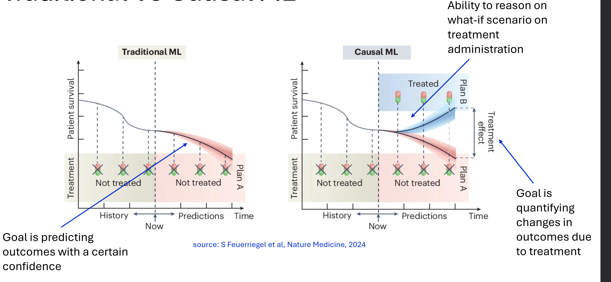

= AIDH - Bayesian Networks
:toc:
:toc-title: Contents
:nofooter:
:stem: latexmath

== Correlation, dependence and causation

RV causes another if manipulating the former affects the distribution of latter

Bayesian networks don't capture this 

In bayes we condition -> we set RV to certain value

Correlation does not necessarily imply causation

=== Reichenbach's Principle

.Definition
****
Let stem:[X] and stem:[Y] be two independent variables such that they are statistically dependents

It holds that:

. stem:[X] is indirectly causing stem:[Y], or
. stem:[Y] is indirectly causing stem:[X], or
. There may be an unobserved common cause stem:[Z] that indirectly causes stem:[X] and stem:[Y]
****

He says that even if X doesnt directly affect Y there can be some Z that indirectly causes both

If I measure correlation there must be some causation even if I don't know what causes it

* Not necessarily - spurious correlations exist

Principle assumes we can perfectly identify statistical dependence from data

In real life we deal with noise:

* Selection bias
* Small datasets
** unbalanced/biased
* Common Trends
** third parties affect our study 

=== The key question

Finding causal link between treatment and outcome

Difficult due to covariates and random chimp events

== Causality

=== Causal BNs

Directed BN

stem:[Y1 \rightarrow Y2] means that Y1 directly causes Y2

stem:[Y1 \leftarrow Y2] means that Y2 directly causes Y1

The models are equivalent BNs but *different* Causal BNs

Setting Y1 to some value will change Y2

=== Intervening on Causal Models

Operating on random variables in the model

*Hard interventions* lock in a value of n RVs leaving the rest unchanged

Intervening changes the distribution of the data

=== Causal ML

Big in healthcare

* allows estimation of treatment effects
** can focus on individual patients

checking difference in bifurcation of treatment vs no treatment

also reason on specific scenarios

* what will happen to Peter if I give/don't give treatment

=== Fundamental problem of causal inference

In causal ML you have difference between treated/not treated

* a single patient can only be treated/untreated
* can't estimate single patients unless?
** better to focus on *average effects*

Traditional ML you predict given history

=== Ideal Interventions

given a RV stem:[Yb] and manually setting it to stem:[k] -> hard/perfect/ideal intervention

Replaces the model's value for stem:[Yb] with stem:[k]

[stem]
++++
do(Y_b:=k)
++++

In general

[stem]
++++
P(Y_2| Y_1 = k) \neq P(Y_2 | do(Y_1:=k))
++++

The probability of stem:[Y_2| Y_1 = k] when stem:[k] occurs naturally is different from stem:[Y_2| do(Y_1 := k)] when stem:[k] is forced *even if stem:[k] is the same value*

* this is because forcing it could break causal relationships that occur in nature

Constrain stem:[Y_b = k] and see what happens

Severing edge from stem:[Y_a] to stem:[Y_b] -> stem:[Y_b] is now deterministic

==== Truncated Factorization

Factorizing interventional distribution

For all RVs that are in do set we factorize the indicator value ???

More formally:

.Truncated factorization formula
[stem]
++++
P(Y_1, Y_2, \dots, Y_n | \text{do}(V := k))
=
\prod_{Y_i \notin V} P(Y_i | Pa(Y_i)) \cdot \prod_{Y_j \in V} \mathbb{I} (Y_j = k_j)
++++

Where:

* stem:[V] is a set of variables
* stem:[k] is a set of values
* intervention stem:[\text{do}(V := k)] assigns a value stem:[k_j] to each stem:[Y_j \in V]
* stem:[\mathbb{I}] is the indicator function
** stem:[\mathbb{I} \in \{0, 1\}]
** stem:[\mathbb{I} = 0] if stem:[Y_j \neq k_j]
** stem:[\mathbb{I} = 1] if stem:[Y_j = k_j]
* stem:[Pa(Yi)] are the parents of stem:[Y_i], i.e. they are the variables that directly influence stem:[Y_i]
* stem:[\prod_{Y_i \notin V} P(Y_i | Pa(Y_i))] assigns the probability using the variable's parents for variables not in the set

== Measuring Causality

=== Average Treatment Effect (ATE)

Measure causal effects of intervention

Does smoking cause cancer? Assess causal relationships by intervening on smoking

* kind of but other confounding factors
** genetics
** living in radium factory
** etc.

given a binary treatment value stem:[T] and outcome variable stem:[O]

[stem]
++++
ATE(T, O) = \mathbb{E} [O | do(T=true)] - \mathbb{E} [O | do(T=false)]
++++

if:

* stem:[ATE \gt 0]: influences positively
* stem:[ATE \sim 0]: no effect
* stem:[ATE \lt 0]: influences negatively

you cant intervene on the outcome but you can on the treatment

estimate effect of causal intervention by measuring the outcome when you intervene and when you don't

* treated pop vs untreated pop

look at this difference in terms of expectation

* given an individual you can't intervene and not intervene

==== ATE interpretations in treatment-outcome covariate settings

You have stem:[X] = health condition

take decision stem:[T] based on stem:[X]

stem:[O] = patient died after 6 months

there is a connection between stem:[X] and stem:[O] -> death is consequence of health condition

find link between stem:[T] and stem:[O] while stem:[X] influences both separately

* e.g. if you treat people BP decreases with age, if you don't it increases

estimate average between treated and untreated while canceling out age

===== Conditional ATE (CATE)

Checking if treatment has effect on subgroups

=== Causal Effect Identification

If we identify adjustment set stem:[X] that lets us match the interventional distribution

we know stem:[P(O | T)] which is different from stem:[P(O | \text{do}(T))]

we need to find stem:[X] such that stem:[P(O | T, X) = P(O | \text{do}(T))]

If stem:[X] is observable and we have enough data we can fit the probabilities
to measure CATE

use learning model to learn stem:[P(X)] and use those to measure (C)ATE

if X is not observable it's simpler to run randomized control trials

=== Randomized Control Trial

To estimaete causal effect of trial stem:[T] on outcome stem:[O] we need to sever the edge from the confounder stem:[X] to stem:[T]

Design data collection (intervene on data generation)

dont assign therapy based on status of patient else its useless

* don't only give therapy to people with terminal AIDS if you're doing a study
* have to assign *_randomly_*

==== Running RC

Randomly assign stem:[T] to stem:[X_s]

Trial: wait and see stem:[O] for pair stem:[(T_t, X_s)]

We get dataset stem:[D] with Trial value (yes/no) and outcome

* stem:[D = \{ (t_1, o_1), \dots, (t_N, o_N) \}]

We use it to estimate ATE

.ATE estimation
[stem]
++++
\mathrm{ATE}(T = \hat{t}, O) \approx \frac{\sum_n \mathbb{I} (t_n = \hat{t}) o_n}{\sum_n \mathbb{I} (t_n = \hat{t})}
++++

Where:

* stem:[\mathbb{I}] is counter

Can do something similar for CATE

If patients alter their behavior during trial that can mess with Trial

* confouding effect between dieting/weight and O given T
* cannot disentangle this

=== Causal Effect Identifiability

The causal effect of a treatment stem:[T] on outcome stem:[O] is identifiable if there exists an adjustment set stem:[X] such that:

.Causal Effect Identifiability with set stem:[X]
[stem]
++++
P(O | \mathrm{do}(T)) = P(O | T, X)
++++

Where:

* stem:[P(O | \mathrm{do}(T))] is the probability of an outcome stem:[O] given that stem:[T] is manually set to some value
* stem:[P(O | T, X] is the probability of an outcome stem:[O] given treatment stem:[T] and adjuster stem:[X]

stem:[\mathrm{do}] calculus allows us to to derive 2 fundamental adjustments:

* the back door criterion to handle observable confounders
* the front door criterion to handle latent (unobserved) confounders 

==== Counterfactual Reasoning

What if I hadn't treated Peter?

What if I had treated Jenny?

Causal BNs can't answer these questions so L

== Structure Learning

Structure learning is about estimating structure of Graph (BN, CBN, etc.)

=== Structure finding approaches

==== Constraint based

Take fully connected network and cut off edges that shouldn't be

There is edge between 2 nodes if nodes are dependent:

* stem:[Y_1] is RV for which I have data
* stem:[Y_2] is RV for which I have data

run statistical test of dependence

if stem:[p] is some value -> keep edge or cut it off

Dangerous because if fully connected then neighbors are whole graph

* Exponential computation and then its joever

==== Search and score

Score graph configurations with magic functions until you end up where you want to be:

. Search the space stem:[\text{Graph}(\mathbf{Y})] of graphs stem:[G_k] that can be built on random variables stem:[\mathbf{Y} = Y_1, \dots, Y_N]
. Score each structure with score function stem:[S] -> stem:[S(G_k)]
. Return the highest scoring graph stem:[G^*]

NP complete problem so like glhf

Scoring functions must be consistent within same Markov Equivalence Classes (see below)

Need to be decomposable

* computable locally
* Score of stem:[\mathcal{G}] needs to be able to be computed on single nodes and/or their parents

Information theoretic:

* data likelihood + complexity penalties

Bayesian:

* graph posterior
* set inital prob and go from there

.Bayesian Scoring Function
[stem]
++++
\log P(D | G) \approx \sum_D \sum_X \tilde{P}(x | \mathbf{pa}(x)) + \log P(G)
++++

Easily overfits, log term penalizes complexity

Constrain search strategy to make more efficient

* start from good structure
** use PC algo
* make as few changes as possible
* search Markov Equivalent graphs
* search space of node ordering
** acyclic -> define partial ordering
** turns into a tree ??

Mix constraint based with search and score -> hybrid models

==== Markov Equivalence Class

Can search in markov space that has graphs with similar structure

* same set of conditional independence in all graphs of space

2 DAGs are Markov equivalent IFF they have the same skeleton and same set of coliders

* stem:[Y1 \rightarrow Y4] and stem:[Y1 \leftarrow Y4] are equivalent because you can reverse the arrow and still have the same assumption

==== Constraint based methods

Markov Equivalence Class can be reconstructed by iteratively performing conditional independence tests stem:[I(X_i, X_j | Z)]:

* stem:[\chi^2] test
* KCI test
* Fisher z-test
* and so on

*ORDER MATTERS* for some reason to avoid super exponential complexity

Level wise testing with PC algorithm

* run cheapest tests first
* cheaper to run on the fewest nodes possible

PC algorithm considers separating conditioning sets stem:[Z] of increasing size

* start with stem:[Z] = empty
* prune if independent

== Structure Learning in Healthcare

Very uninterpretable with complex biomedical data because lmao

Reduce complexity by not only relying on data

* ask clinicians about connections that make sense and remove those that don't (good luck with that)
* use constraint methods to prune the graph
* use Markov blanket on outcome node to build other models
* embed chronological knowledge
** order of measurements and data matters
** broken legs don't cause falls (kinda)