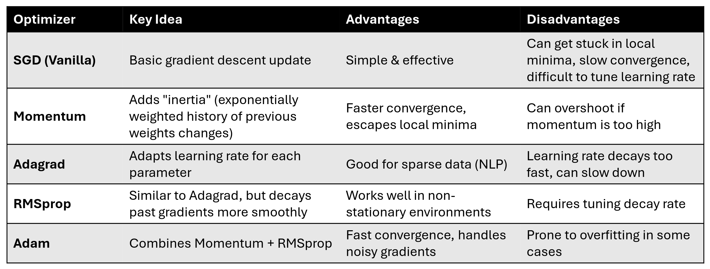

= AIDH - Deep Learning Fundamentals
:toc:
:toc-title: Contents
:nofooter:
:stem: latexmath

== Shallow NN to Deep NN

MLP is a shallow NN

Simply adding more layers does not a deep network make

=== DNN Computation

DNN is a composition of functions that takes input stem:[\mathbf{x}] and passes it to a bunch of other functions

Takes input with dimension stem:[\mathbf{x}] and transforms into output with dimension stem:[\mathbf{h}]

.DNN function composition
[stem]
++++
DNN_{\Theta} = g_{\theta y}

(g_{\theta^{h_l}}
    (g_{\theta^{h_{l-1}}}
        (\dots
            (g_{\theta^{h_1}}
                (\mathbf{x})))))
++++

Where:

* stem:[\Theta] is a set of learnable parameter matrices stem:[\Theta = \{ \mathbf{\theta}^{h_1}, \dots, {\theta}^{h_l}, {\theta}^{y} \}]
* stem:[\varphi_l] is the activation function for layer stem:[l] 
* stem:[\mathbf{h}_1 = g_{\theta^{h_1}}(\mathbf{x}) = \varphi_1 (\mathbf{\theta^{h_1} x})] is the representation of input stem:[\mathbf{x}] at the first hidden layer
* stem:[\mathbf{h}_2 = g_{\theta^{h_2}}(\mathbf{h_1}) = \varphi_2 (\mathbf{\theta^{h_2} \mathbf{h_1}})] is the representation of intermediate output stem:[\mathbf {h_1}] at layer 2  
* stem:[\mathbf{h}_l = g_{\theta^{h_l}}(\mathbf{h_{l-1}}) = \varphi_l (\mathbf{\theta^{h_l} \mathbf{h}_{l-1}})] 
* stem:[y = g_{\theta^y}(\mathbf{h}_l) = \varphi_y (\mathbf{\theta}^y \mathbf{h}_l)]

There is a set of learnable parameters (1 per layer including output)

Each layer can have a different activation function (keyword *CAN*, it does not have to)

DNNs work on the assumption that inputs are compositional - inductive bias towards compositional input

=== Learning Hierarchical Representation

Early layers extract basic/specific/fine grained information - noisy

As we go deeper the features we learn become more abstract

* they learn complex features
* They combine basic representations seen earlier into more general representations
* Abstract representations are more robust because they encode the semantics of the object (more general representations)
* Final layers combine abstract features into simple task specific representation

Especially useful in computer vision and NLP where feature order is critical

* "dying I'm help" != "help I'm dying"

=== Efficient Learning

Deeper networks (more layers) are generally better than wider networks

. Better feature abstraction
* Layers refine representations from previous layers
. More efficient learning
* Represents complicated functions as compositions of simpler functions
* fewer neurons means less over fitting which means generally better
. Improved generalization
* capture meaningful patterns with fewer parameters

By composing you can effectively and efficiently bend decision boundaries without needing a billion parameters

More layers means the model is able to create more and more complex decision boundaries

=== Challenges of learning

Model selection becomes more expensive as the number of layers grows

* Deep learning has a bunch of funny new hyperparameters to keep in mind

Overfitting is also a problem

* DNNs can easily memorize training data which is bad

Requires a *LOT* of data

* order of 100k
* very hard to label a dataset with 100k samples

Limited usefulness on non compositional input

* only use deep learning if task/data is compositional OR you can somehow extract composition

Computational/numerical challenges

* requires right hardware
** lot of memory and powerful computing
* training can be unstable (gradient+optimization issues)

== Tackling Deep Learning Challenges

=== DNN Training

Works by backpropagation (gradient for each layer) and gradient descent

*BUT*

* Blindly applying backprop makes learning difficult and training unstable
* Finding the global minimum of the gradient becomes a nightmare
* Complex networks have more complex loss landscapes to optimize
* Networks with too many parameters can become extremely demanding to train

=== The Original Sin

Gradient explosion/gradient vanish

Problems rooted in multiplication chains

* multiplying very small numbers by very small numbers is bad
* multiplying increasingly big numbers with each other is also bad

TLDR keep norm of gradient ~1

==== Vanishing gradient

If norm of gradient is < 1:

* Gradient at the output will be relatively large
* Gradient at layer n will be smaller than output gradient
* And so on
* Multiplying increasingly small numbers can collapse the result to 0
** gradient will be annihilated
** we learn nothing

==== Exploding gradient

If norm of gradient is > 1:

* Causes exponential growth of gradient
* Causes ping pong during gradient descent
** difficult to minimize loss
** will never converge
* Exploding gradient can be clipped to minimize the effect

== Remediations

* Weight initialization
* Activation normalization
** helps regularization and optimization
* Regularization
* Residual connections
** input will skip some layers
** black magic that reduces risk of exploding/vanishing gradient
* Optimization
** makes gradient descent walk more manageable

=== Role of the activation function

During backprop we multiply the error term of the previous layer by the derivative of the activation function

A good derivative does not explode or vanish

Derivative of sigmoid is bad because near 0

ReLU is better for DNN midlayers

* Maintains derivative ~1 which avoids gradient chicanery

CAUTION: does not work nicely with all DNNs (e.g. RNNs) because it doesn't saturate after 0, which means that inputs become immense in RNNs

WARNING: if too many neurons are activated to 0 they stop learning (gradient of stem:[f(0) = 0]). Known as dying ReLU

There are variations on ReLU for more specific applications:

["3,5"]
|===
|Activation Function |Formula |Fixes dying ReLU

|Leaky ReLU
|stem:[\max{(0.01x, x)}]
|Yes, gives stem:[x \leq 0] a small slope

|Parametric ReLU
|stem:[\max (\alpha x, x)] where stem:[\alpha] is learned
|Yes, learns best slope for negatives

|Exponential ReLU
|stem:[x \ \text{if} \ x \gt 0, \alpha(e^x - 1) \ \text{if} \ x \leq 0]
|Yes, smooth negative gradients

|Gaussian Error ReLU
|stem:[0.5x(1+\tanh(\sqrt{2/\pi} (x + 0.0447x^3)))]
|Yes, used in transformers (better for NLP)

|Scaled Exponential ReLU
|stem:[\lambda x \ \text{if} \ x \gt 0, \ \lambda \alpha(e^x - 1) \ \text{if} \ x \leq 0]
|Yes, used in self normalizing networks

|===

SELU is most commonly used in DNNs

=== Weight Initialization

Initializing with the right values 

WARNING: DON'T initialize to 0

* if we init to 0 then all neurons will respond exactly the same way 
* we want specialization
** we want different neurons to respond differently to different things
* if weights are too big they might saturate the activation function earlier than expected
** operate within dynamic range of activation function i.e. where the gradient is larger
* normalize weights with respect to number of inbound/outbound connections to the neuron

Avoid symmetry in weights unless needed

Ensures faster/stabler convergence and improved accuracy

==== Weight initialization strategies

===== Random initialization

* test different random init values until you find the ones that work best (lmao)
* use small variance Gaussian/normal distributions to avoid big values being cringe
** i.e. falling outside the midrange of the activation function i.e. immediately saturating the neuron for no reason

===== Glorot/Xavier initialization

Weights are drawn from one of the following distributions:

.Glorot initalization distribution
[stem]
++++
U \Biggl( - \frac{\sqrt{6}}{\sqrt{n_{in} + n_{out}}}  , \frac{\sqrt{6}}{\sqrt{n_{in} + n_{out}}}\Biggr)
\\
\text{or}
\\
\mathcal{N} \Biggl(0, \frac{2}{n_{in} + n_{out}} \Biggr)
++++

Where:

* stem:[U] is a uniform distribution
* stem:[\mathcal{N}] is a Gaussian
* stem:[\text{in}] is the number of input units to a layer
* stem:[\text{out}] is the number of output units from a layer

Maintains balanced weight distribution

Smoothens gradient flow

* improves backprop

Works best for sigmoid and tanh

* center ~0.5

===== HE initialization

Similar to Glorot

Designed for asymmetric activation functions like reLU (e.g. zero center mean)

[stem]
++++
U \Biggl( - \frac{\sqrt{6}}{\sqrt{n_{in}}}  , \frac{\sqrt{6}}{\sqrt{n_{in}}}\Biggr)
\\
\text{or}
\\
\mathcal{N} \Biggl(0, \frac{2}{n_{in}} \Biggr)

++++

=== Activation Normalization

Normalize the output of a layer to improve performance

Constraining distribution within some controllable range

==== Batch Normalization (BN)

Partition training data into subdatasets (mini batches)

Train with gradients averaged over mini batches

. Compute mean + var across batch

. Normalize activation

. Scale and shift through learnable parameters

* allows model to decide if it wants to cancel it by backprop

1 epoch has many mini batches

CAUTION: parameters and elements change between batches which can confuse the neuron

Normalize hidden layer activations to solve

WARNING: if your dataset is a sequence then bad because BN assumes independence

More formally:

.BN procedure
[stem]
++++

\text{1. Compute mean and variance across the batch} \\
\mu^l_B = \frac{1}{N_B} \sum^{N_B}_{i=1} h^l_i

\\ \text{and} \\

\sigma^l_B = \frac{1}{N_B} \sum^{N_B}_{i=1} (h^l_i - \mu^l_B)^2 \\

\\ \text{2. Normalize activations} \\

\hat{h}^l_i = \frac{h^l_i - \mu^l_B}{\sqrt{(\sigma^l_B)^2 + \epsilon}}

\\ \text{3. Scale and shift through learnable parameters } (\gamma, \beta) \\

\hat{h^l_i}' = \gamma \hat{h^l_i} + \beta

++++

Where:

* stem:[l] is the current layer
* stem:[i] is the minibatch sample
* stem:[\mu^l_B = \frac{1}{N_B} \sum^{N_B}_{i=1} h^l_i] is the activation of one neuron in layer stem:[l] for minibatch sample stem:[i]
* stem:[\epsilon] is a term to avoid dividing by 0
* stem:[\gamma] and stem:[\beta] are backpropagation values
* stem:[\hat{h^l_i}'] is the input to layer stem:[l + 1]

==== Layer Normalization (LN)

Takes average activation of the layer and subtracts it from every neuron at layer L

. Compute mean and variance across layer
. Normalize activation value stem:[\in \{0, 1\}]
. Scale and shift

Rule of thumb is to not normalize every layer, give it a break

More formally:

.Layer Normalization
[stem]
++++
\text{1. Compute mean and variance across layer} \\

\mu^l = \frac{1}{N_l} \sum^{N_l}_{j=1} h^l_j \\

\text{and} \\ 

\sigma^l = \frac{1}{N_l} \sum^{N_l}_{j=1} (h_j^l - \mu^l)^2 \\

\text{2. Normalize activations} \\

\hat{h^l_i} = \frac{h_i^l - \mu^l}{\sqrt{(\sigma^l)^2 + \epsilon}} \\

\text{3. Scale and shift through learnable parameters } (\gamma, \beta ) \\

\hat{h^l_i}' = \gamma \hat{h^l_i} + \beta
++++

==== Regularization

L1 + L2 are good

Drop out regularization is useful in deep learning

===== Drop out regularization

Applied at every batch

Used on densely connected networks

It randomly silences neurons:

* tells network it can't simply use all the information
* makes network more robust as it learns to use fewer samples

Make binary mask `0, 1` of `len == len(layer)`

* draw it from Bernoulli with stem:[p] = probability of silence
* stem:[p] controls level of regularization
* applied as a layer after a hidden layer
* stem:[p] is hyperparameter learned during model selection

If corresponding neuron is at 0 then they are silenced

At test time multiply everything by stem:[p] else activation too high

Dropconnect does the same but silences connections instead of neurons

* mask will be bigger than input

=== Residual Connections

Passes input to initial layer and a later layer simultaneously

For example:

. For images stem:[f(x)] is noise
. Fast forward x as identity of original image
. Subtract noise from image
. ???
. Receive clean image

Focuses layers on a simpler narrower problem 

=== Optimizers

Functions that perform SDG to update model parameters

Different Optimizers do different things

Adam is most common but it depends on the task

=== Gradient Clipping

Set a max threshold for norm of gradient

If `norm(gradient) > threshold` then normalize it

i.e. `if going_to_explode(): dont()`

== Neural Autoencoders

Takes input stem:[\mathbf{x}] and learns to predict stem:[\mathbf{x}]

* reconstructs its own input
* learns identity of itself
* needs to pass through an information bottleneck
** learns to encode essential information into the bottleneck layer

Used to solve unsupervised tasks:

* Anomaly/outlier detection
* Compression/dimensionality reduction
** visualizing n-dimensional data as 2D data to check for clusters
* Data Generation

=== Anomaly/Outlier Detection

Check if input is siginficantly different from expectation

Autoencoders learn general population variation

If it sees something wacky itll produce wacky output

Compare wacky output with expected output

Input is probably anomalous

Can use threshold stem:[\tau] to check for chicanery (also model selection hyperparameter)

* if `error > threshold` then chicanery
** model says idk whats wrong with it but its wrong for sure
* else fine

Can also run a hypothesis test using statistics (or check AUC) to make it more refined

=== Bottleneck Autoencoder

3 main parts:

. Decoder
* Take input and encode it into smaller representation
. Bottleneck
* Pass through hidden layer of `size < input size`
. Encoder
* Spit out approximated input based on bottleneck layer

Trained with MSE on x

=== Denoising Autoencoder

Relaxes bottleneck assumption (might not even require one)

Take sample from dataset

Modify it

* add vector of Gaussian noise stem:[\epsilon]
** e.g. add a noisy image to a clean image
* every sample needs a different noise sample

Feed it to input layer

Go through hidden layers

Spit out denoised image

Backprop is comparison between output stem:[\hat{x}] with clean stem:[x] (i.e. data straight from dataset)

=== Deep Autoencoder

Keep encoder part of autoencoder

Use it to combine it with other methods

Like using linear regression at H4 to predict something

=== Greedy Layerwise Pretraining

Train an autoencoder using other autoencoders (what are these mfs on)

Train 1 on input data

save layer 1

Train 2 using h1 from layer 1

Repeat until done

