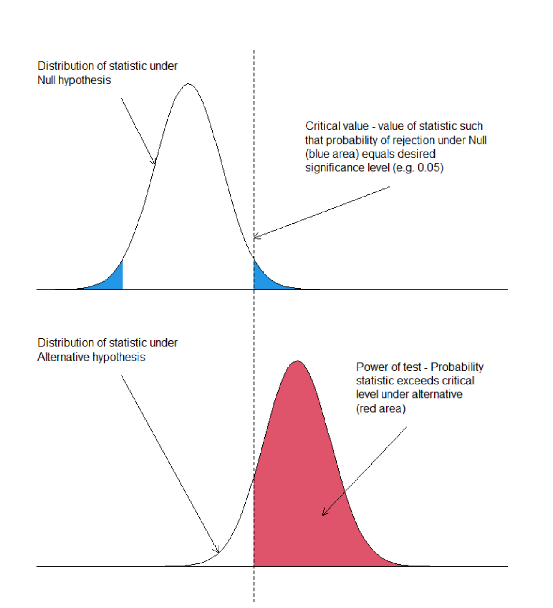
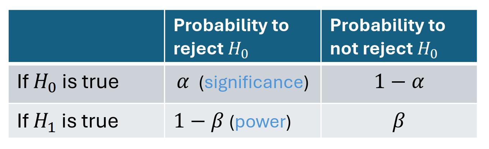

= Fundamentals of Probability and Statistics for AI
:toc:
:toc-title: Contents
:nofooter:
:stem: latexmath

== Refresher on probability

=== Fundamental principles and definitions

Probability is a measure of uncertainty of events/outcomes

* Sample space: The universe of all possibilities that can happen to a variable
* The area of the whole space is 1
** Any event takes up a bit of that space
** Different events take up different sized areas

Probability in AI:

* helps us make informed decisions
** model output is 42 but unsure -> keep into account
* we use probability to drive the training of models

==== Healthcare examples

Predicting whether a patient will develop a given condition

* Sample space: includes all possible outcomes
** develops x/y conditions
** develops no condition

== Common random variables

Random variables = variables whose outcomes are determined by chance

* Actually functions
* Assign an encoding to the manifestation of an event
** stem:[X: \Omega \rightarrow R] where stem:[\Omega] is the sample space

* e.g coin toss
** Heads = 0, tails = 1

=== Types of random variables

Use capital (X) to denote RV and lowercase to denote value (x)

* Discrete: variables whose value stem:[X = X_i] where stem:[(i=1, 2, 3, \dots)]
** X1 says the outcome of this event is the coin landed on tails
** Compute stem:[P(X) == 0, P(X) == 1]
** Takes values from a countable set (infinite but countable)

* Continuous: variables whose value stem:[X \in [a, b\]]
** Takes values that cannot reasonably be described by countable sets
** weight, height, etc
** if X is height -> stem:[X \in [0, 260\]]
** stem:[P(X = h)] is unfeasible, use stem:[P(X \leq h)] - measure intervals instead of exact values

RVs model attributes of our data

* blood pressure is continuous
* number of patients developing a condition is a discrete random variable

=== Probability functions

Discrete random variables

* Probability function stem:[P(X = x) \in [0, 1\]] measures the probability that X has the value x
* Subject to sum rule stem:[\sum_{x^e}^{\sigma} P(X = x) = 1]
** Sum of all possible events must = 1

* Continuous RV describe the relative likelihood
* density function p(t) describes the relative likelihood of RV to take on value t
* subject to sum rule stem:[\int_{\sigma}^{t} p(t) dt]
* Defines a probability distribution e.g. stem:[P(X \leq x) = \int_{-inf}^{x} p(t)dt]
** all values in continuous interval

Shorthand stem:[P(X)] for stem:[P(X=x)] or stem:[P(X \leq x)]

== Common distributions

=== Binomial distribution

Models discrete outcomes with 2 possible outcomes

* can be generalized to multinomial
* Models coin tosses, positive response to a new drug (0 no response, 1 response)

[stem]
++++
P(X=k) = \binom{n}{k} p^k(1-p)^{n-k}
++++

Where:

* p is response probability
* k is positive response
* n is number of patients

=== Poisson distribution

Models the number of independent events within an interval

e.g. number of patients admitted to ER in given time interval

[stem]
++++
P(X = k) = \frac{\lambda^k e^{-\lambda}}{k!}
++++

Where stem:[\lambda] is the mean number of events within the timeframe (e.g. patients per hour)

=== Normal/Gaussian distribution

Reference continuous distribution

* Models continuous data (height/weight)
* Data tends to cluster around mean stem:[\mu] (x axis center) with spread stem:[\sigma^2] (height/width of gaussian)
* Probability is area under curve up to interval (integration)

=== Joint and conditional probabilities

Predicting the outcome given attributes -> joint probability
* probability of multiple things occurring

[stem]
++++
P(X_1 = x_1, \dots, X_N = x_n) = P(x_1, \dots, x_n)
++++

Predict outcome of male middle age patient with high blood pressure

Break down/factorize long joint distribution into products of smaller distributions

==== Conditional distributions

Conditional probabilty of x1,..., xn given y (you can have any number of y)

stem:[P(x_1, \dots, x_n | y)]

We don't know about x1 etc but we know y has occurred

* e.g. probability of having high blood pressure given that patient is male
* e.g. probability of having high blood pressure and high cholesterol given that patient is female

you want to cancel effects of y by separating the population

stem:[P(x|y)] is really a family of distribution

there is a distribution stem:[P(x|y)] for each value of y -> each of these is independent (each sums to 1 independently)

==== Chain rule

[stem]
++++
P(x_1, \dots, x_i, \dots, x_n|y) = 
\prod^{N}_{i=1}
P(x_i | x_1, \dots, x_{i - 1}, y)
++++

==== Marginalization

Using the sum and product/chain rules together yields the complete probability

[stem]
++++
P(X_1 = x_1) = 
\sum{P(X_1 = x_1 | X_2 = x_2)}
{P(X_2 = x_2)}
++++

if I dont know stem:[P(X1)] but I know stem:[P(X1) | P(X2)] and i know something about stem:[P(X2)] 

==== Bayes rule

Given hypothesis stem:[h_i \in H] and observations d:

[stem]
++++
P(h_i | d) = 
\frac{P(d|h_i)P(h_i)}{P(d)} = 
\frac{P(d|h_i)P(h_i)}{\sum_j P(d|h_j)P(h_j)}
++++

stem:[P(h_i)] is the prior probability of stem:[h_i]
measures a priori confidence on a condition (e.g. based on general frequency)

stem:[P(d|h_i)]: conditional probability of observing d given that stem:[h_i] is true
e.g. too much coffee = coronary disease -> if high coffee -> high risk etc.

stem:[P(d)]: marginal probabilty of d *DONT NEED IT*

stem:[P(h_i| d)] how I assess my hypothesis after Ive seen the data

==== Expectation of a random variable

Long term average/mean value of a random variable over many trials

Represents the center of mass of a probability distribution

===== Discrete RV:

[stem]
++++
\mathbb{E}_{x \sim{P}}[X] = \sum_{x \in \Omega} x \cdot P(X = x)
++++

*Example*

stem:[X] = number of patients arriving at the ER in an hour

stem:[X] = 0, 1, 2, 3, 4, 5

Probabilities stem:[P(X = x) = \{0.1, 0.2, 0.3, 0.25, 0.1, 0.05\}]

stem:[\mathbb{E}[X\] = (0 \cdot 0.1) + (1 \cdot 0.2) + (2 \cdot 0.3) + (3 \cdot 0.25) + (4 \cdot 0.1) + (5 \cdot 0.05) = 2.2]

Meaning that on average we expect 2.2 patients to come to the ER every hour

===== Continuous RV:

[stem]
++++
\mathbb{E}_{x \sim{P}}[X] = \int_{x \in \Omega} x \cdot p(x)dx

++++

*Example*

Blood pressure distribution

stem:[X] = systolic blood pressure in a population

Assuming stem:[X] follows a normal distribution with:

stem:[\mu = 120] (mean), stem:[\sigma^2 = 15^2] (variance)

stem:[\mathbb{E}[X\] = \mu] for a normal distribution

stem:[\therefore \mathbb{E}[X\] = 120] for this population 

===== Linear operator that also works on functions of RVs

[stem]
++++
\mathbb{E}_{x \sim{P}}[f(X)] = \sum_{x \in \Omega} f(x) \cdot P(X = x)
++++

== Refresher on statistics

* We have observations from the world and we want to find out stuff

* Descriptive: values that describe the data (mean, median)
* Inferential: infer something about the data
** e.g. check if a drug works or if it's chance

=== Hypothesis testing

Null vs alternative

* stem:[H_0] = no difference between treatments
** e.g. drug vs placebo have same effect
* stem:[H_1] = there is a difference
** e.g. drug has effect and placebo doesn't

We reject stem:[H_0] if critical value < chosen sig level

* P value is the probability of obtaining a result as extreme as the one observed assuming H_0 is true

* Small P = stem:[H_1] is true

* High P = stem:[H_0] is true

The distributions of stem:[H_0] and stem:[H_1] overlap -> stem:[H_0] can be true with very small probability

=== Statistical power

Beta is probs of not rejecting stem:[H_0] if stem:[H_1] is true

Test power: stem:[1 - \beta] is the probability that the test correctly rejects stem:[H_0] when stem:[H_1] is true

== Statistical Dependence and Correlation

Measuring if 2 or more things are linked

=== Correlation

Strength and direction of a linear relationship between 2 random variables

*correlation != causation*

Measure of trends

=== Dependence

Measures how one random variable changes in relation to another

Captures non-linear relationships

*Effect does not affect the cause*

No way of measuring causality unless you can operate on the population

== Independence and Conditional Independence in Probability

2 RV X and Y are independent if knowledge about X does not change the uncertainty about Y

Joint prob = stem:[P(X) P(Y)]

2 RV X and Y are conditionally independent given Z 

e.g. if I know that something else has occurred then P(X) and P(Y) are conditionally independent

probability of wearing sunglasses is dependent on bringing an umbrella unless it's raining -> conditionally independent

=== Measuring Correlation and Dependence

==== Linear Correlation 

Uses Pearson's correlation coefficient for quantitative data

Ranges from stem:[[-1, +1\]]:

* if +1 -> one goes up other goes up
* if -1 -> one goes up other goes down
* if 0 -> no measurable *linear* correlation 
** there can still be non linear correlation

Ratio between covarience of X, Y and the product of their Stdev

Pearson population correlation coefficient formula:

[stem]
++++
\rho_{X, Y} = \frac{cov(X, Y)}{\sigma_x \sigma_y}
++++

or

[stem]
++++
\rho_{X, Y} = 

\frac
    {
    \mathbb{E}_{x,y \sim P}[(X - \mu_x)(Y - \mu_y)]
    }

{\sigma_x \sigma_y}
++++

Where stem:[\mathbb{E}_{x,y \sim P}] is the expected value of x or y

R sample coefficient formula:

[stem]
++++
r_{xy} = 
    \frac
    {
    \sum_{i=1}^n(x_i - \bar{x_i})
    (y_i - \bar{y_i})
    }
    
    {
    \sqrt{(x_i - \bar{x_i})^2}
    \sqrt{(y_i - \bar{y_i})^2}
    }
++++
==== Mutual Information (MI)

Estimates the information gained about one RV by knowing another

MI is only useful if stem:[P(X)] and stem:[P(Y)] are *dependent*

if they are entirely independent then stem:[MI = 0]

[stem]
++++
MI(X, Y) = 
\Sigma_{x \in \Omega_x, y \in \Omega_y}
P(x, y) log\Biggl(\frac{P(x, y)}{P(x) \cdot P(y)}\Biggr)
++++

e.g. assess how a patients age (X) influences disease presence (Y)

Entropy = stem:[H] is a measure of probabilty in a distribution

If stem:[H] is the information stem:[(X, Y)] then MI is the intersection stem:[MI(X, Y)] of stem:[ H(Y|X)] and stem:[ H(X|Y)]

High random uniform has high information

Deterministic events have low information

MI can be estimated

==== Conditional MI

Estimaes information leakage between X and Y given Z

e.g. measuring the relation between smoking and lung cancer while controlling for age

i.e. keep age the same -> check smoking and lung cancer
