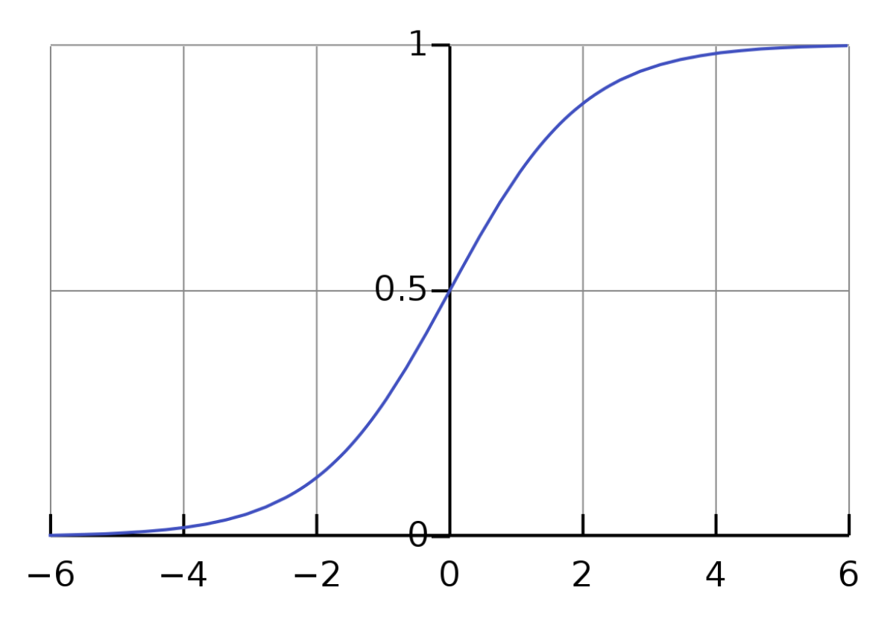
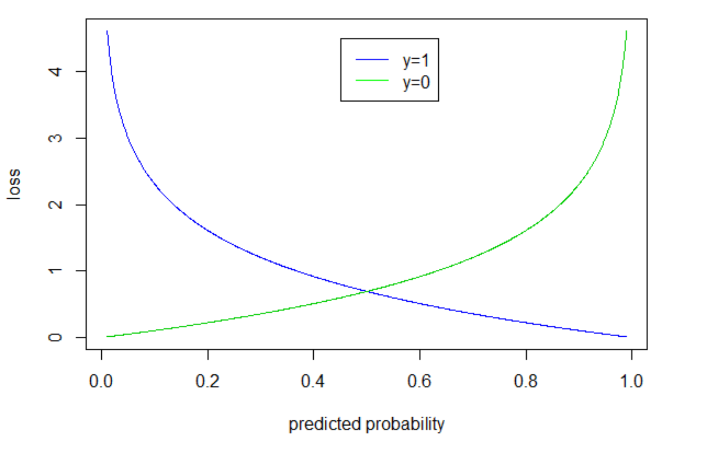

= AI for DH
:toc:
:toc-title: Contents
:nofooter:
:stem: latexmath
:stylesheet: styles.css

== Linear regression

=== Vectorized linear regression

Collate all inputs and responses into matrices/vectors for compact formulation

Each row is a sample/subject

Each column is a feature

// matrix + vectors
[stem]
++++

\mathbf{X} = 

\begin{bmatrix}
x_1^1 \dots x_k^1\\

\vdots \ddots \vdots\\

x_1^N \dots x_k^N
\end{bmatrix}

\mathbf{y} = \begin{bmatrix} y^1\\ \vdots \\ y^N \end{bmatrix}

\mathbf{\theta} = \begin{bmatrix} \theta_1\\ \vdots \\ \theta_k \end{bmatrix}

++++

Vectorized formulation on dataset D

[stem]
++++
\mathbf{y = X \theta + \epsilon}
++++

where stem:[\epsilon] is the error term

with output matrix Y where each col is a feature and each row is a parameter

with stem:[\mathbf{\epsilon}] is now a column vector of normally distributed values

stem:[\mathbf{\epsilon} = [\epsilon^1, \dots, \epsilon^N\]^T] and stem:[\epsilon \sim \mathcal{N}(\mathbf{0}, \sigma^2)]

stem:[\mathcal{N}] represents a multivariate Gaussian (normal) distribution

If we predict M response variables we have a system of linear equations where stem:[\mathbf{Y}] is a matrix of responses instead of a vector

=== Training a linear regression model

Assume a single response variable -> define a loss function for the model

==== Mean Square Error

Find theta that minimizes MSE

[stem]
++++
E(h_\theta | D) = \frac{1}{N}\sum_{(\mathbf{x}^i, y^i)} (y^i - \hat{y}^i)^2
++++

We need to find the lowest error with respect to model parameters

[stem]
++++

argmin_\theta \frac{1}{N} \sum_{(\mathbf{x}^i, y^i)} (y^i - \mathbf{x}^i \mathbf{\theta})^2

++++

where stem:[y^i - \mathbf{x}^i \mathbf{\theta} = y^i - \hat{y}^i]

* penalizes large errors
* sensitive to outliers
* differentiable and has closed form solutions

*Ordinary Least Squares* has closed form solutions for minimizing MSE in linear regressions

[stem]
++++

argmin_\theta \frac{1}{N} \sum_{(\mathbf{x}^i, y^i)} (y^i - \mathbf{x}^i \mathbf{\theta})^2 

= 

argmin_\theta \frac{1}{N} (\mathbf{y} - \mathbf{X \theta})^2

++++

Take the derivative of the regression error:

[stem]
++++
\frac{\partial(\mathbf{\epsilon})^2}{\partial \theta}

=

\frac{\partial{(\mathbf{y - X \theta})^2}}{\partial \theta}

=

\dots

=
 -2(\mathbf{X^T y}) + 2(\mathbf{X^T X \theta}) = 0
++++

One shot estimation of theta (dont need to iterate)

Correlate pseudo inverse of input data matrix with y (predictions)

[stem]
++++
\mathbf{\theta = [(X^T X)^{-1} X^T]y}
++++

Where *pseudoinverse*  = stem:[\mathbf{(X^T X)^{-1} X^T}]

=== Regularization

Since we need to avoid overfit we need to use the smallest length of stem:[\mathbf{\theta}] possible (i.e. as few parameters as possible)

Many ways of doing it (most commonly we look at the norm of theta stem:[||\theta||]):

* L2 (Ridge)
* L1 (Lasso)
* Elastic Net (Combination of 1 and 2)

==== Ridge Regression (L2)

penalise MSE with norm2 (sum of squares of elements of vector)

if stem:[\mathbf{X}] matrix isnt well conditioned we risk getting bad inversions and we get a numerically unstable system 

* if the values are really small or really big we might get unexpected results
* bad if we have collinearity in data (features depend on each other)

stem:[\lambda] is the radius of the circle around the origin (hyperparameter that balances cost and penalty)

if we have big stem:[\lambda] we get closer to the loss landscape center but we risk overfitting

OLS formula + penalty term

[stem]
++++
\lambda ||{\mathbf{\theta}||^2_2}
++++

we get a different more numerically stable solution by adding some stem:[\lambda] weight to the diagonal of the matrix to be inverted

[stem]
++++
\mathbf{\theta = [(X^TX + \lambda I)^{-1}X^T]y}
++++

==== Lasso Regression (L1)

same as L2 but uses absolute values instead of squared values

* pushes some values to 0
* others to big (sic.)

It can also do feature selection (kinda)

* if stem:[\theta_2] and stem:[\theta_4] are set to 0 then theyre probably not useful

no closed form one shot solution

need gradient descent

use first norm of vector instead

[stem]
++++
\lambda ||\mathbf{\theta}||_1
++++

==== ElasticNet (combined)

We get a grid of stem:[\lambda]s to use for grid search (?)

Has effects of both L2 and L1 -> apply both regressions at the same time

=== Mean Absolute Error

Instead of taking the square of the error we take the absolute value

Causes problems when applying L2 (no closed form solution cuz discontiguous to 0 (lol))

Treats all errors equally

Less sensitive to outliers

Not differentiable everywhere (no one shot solution/no closed form solutions)

Have to recurse (bruh)

=== Confidence intervals on errors

(N is the number of samples in the training set)

Can easily estimate them on 1D linear regression

e.g. draw tube that encompasses 95% of the data

[stem]
++++
ci = \hat{y} \pm z \cdot \bar{err}
++++

where: 

[stem]
++++
\bar{err} = 

\sqrt{MSE

\Biggr(\frac{1}{N} + \frac{(x - \bar{\mu_x})^2}

{\sum_{i=1}^{N} (x_i - \bar{\mu}_x)^2}\Biggl)}
++++

regression line is stem:[\pm z]

where z is the critical value

corresponds to the confidence level alpha assuming a Student distribution with N-2 degrees of freedom 
stem:[z = t_{1 - \alpha, N-2}] 

the more data -> the narrower the tube

== Logistic regression

Binary classification task

Given input stem:[x] assign a class stem:[ y \in \{0, 1\}] according to function stem:[y = f(x)] with model stem:[h_\theta]

Usual dataset D

Input/free variables stem:[x^n = [x^n_1, \dots, x^n_k, \dots, x^n_D\] \in \mathbb{R}^D] (where x is real number)

output/response variable stem:[y]

add dummy column stem:[x_0] full of 1s

*Learning a decision boundary separating 2 classes (1 samples and 0 samples)*

Assign an input x to the probability of being in class 1 stem:[P(y=1 | x)] and implicitly 0 (1 - the other formula)

The further the point is from the boundary the more convinced we are the point is == 1 (same but opposite for 0)

Thing that computes score -> linear regression

Thing that makes decision -> logistic function

=== Building logistic regressions

Sum of products ( stem:[\theta_i, x_i]) -> scalar stem:[y]

[stem]
++++

y = \theta_0 + \theta_1x_1 + \theta_2x_2 + \dots + \theta_Dx_D = \sum^D_{k=1} \theta_kx_k = \mathbf{x\theta}

++++

* stem:[y(\theta_k) > 0] -> theta is correlated to class 1
* stem:[y(\theta_k) < 0] -> theta is correlated to class 0
* stem:[y(\theta_k) = 0] -> feature is irrelevant

We need a specific function that takes in y (unbound value -inf/+inf) and returns a value between [0, 1] -> squashing function

The sum of the outputs also need to sum to 1 cuz probability

We can use a *sigmoid*

We also avoid MSE cuz bad optimization

==== Sigmoid

Defined as:

[stem]
++++
\sigma(x) = \frac{1}{1+e^{-x}}
++++

Y or stem:[\theta_x] is on x axis: 

* for stem:[\theta_x] going to -inf ~> 0
* for stem:[\theta_x] going to +inf ~> 1
* for stem:[\theta_x] == 0 -> 0.5

or more formally:

* stem:[x \geq 6 \rightarrow \sigma(x) \approx 1]
* stem:[x \leq 6 \rightarrow \sigma(x) \approx 0]
* stem:[x = 0 \rightarrow \sigma(x) \approx 0.5]

Final model is stem:[h_\theta(x) = \sigma(x_\theta)] -> sigmoid of linear regression

=== Training logistic regression

We use binary cross entropy

when y = 0 we cancel one of the parts of the formula

bad

no closed form solution cuz ofc

need to do funny things to optimize it

=== Gradient based approach

vector of partial derivative (one derivative for each parameter)

vector of same len as theta

take negative derivative of error function 

=== Gradient Descent

gradient descent:

for each parameter (in parallel):

. start somewhere on the function
. go down to ith sample
. compute error
. check gradient
. go down according to learning rate
. repeat until near 0 or until out of epochs

Iterative algorithm to find minimum of *any* function

Used to update stem:[\theta] to progressively reduce the loss

Steps:

. Initialize stem:[\mathbf{\theta}] with random values
. Compute the loss using the assigned stem:[\mathbf{\theta}] (call it stem:[\mathbf{\theta_{old}}])
. Compute the gradient of the loss:
* stem:[\mathbf{\nabla_\theta L} = \mathbf{x}(h_\theta(\mathbf{x}) - y)]
. Update stem:[\mathbf{\theta}] using the rule:
* stem:[\mathbf{\theta_{new}} = \mathbf{\theta_{old}} - \eta \mathbf{\nabla_\theta L}]
** stem:[\eta] = learning rate
** controls how big the update step is
** usually < 1 to ensure stable convergence
*** if too big we bounce between the curves and we never converge
*** if too small we risk needing 10 billion iterations OR we get stuck in local minima and never converge

The gradient tells us how to tune stem:[\theta x]:

* If the gradient is positive then stem:[\theta x] should decrease
* If the gradient is negative then stem:[\theta x] should increase

=== Binary Cross Entropy 

Loss function for logistic regression

[stem]
++++

L(h_\theta(\mathbf{x}, y)) = 

-ylog(h_\theta(\mathbf{x}))

-(1 - y)

log(1 - h_\theta(\mathbf{x}))

++++

BCE gradient is the vector of partial derivatives of the loss function with respect to the weights stem:[\mathbf{\theta}]

[stem]
++++

\nabla_{\mathbf{\theta}}L = 

\frac{\partial L}{\partial \theta_k}

\Biggm\lvert_{k=1 \dots D}

=

\Biggr[    
    \frac{\partial L}{\partial \theta_1}

    \dots 
    
    \frac{\partial L}{\partial \theta_d}
\Biggl]^T

++++

or also

[stem]
++++
\nabla_\theta L = \mathbf{x}(h_\theta(\mathbf{x})-y)
++++

where stem:[(h_\theta(\mathbf{x})-y)] is the error made when predicting stem:[y] with the current parameters stem:[\mathbf{\theta}]

and stem:[\mathbf{x}(h_\theta(\mathbf{x})-y)] is the contribution of each feature to the error

this is a vector

correlating each feature of the input vector to the error

you can apply regularization to logreg but you always do gradient descent

=== Limitations of logistic regression

LogReg draws lines to separate classes

You can only use it if the data is linearly separable

* If clustered/nonlinear -> cant
* If inseparable -> cant

=== Linear regression towards neural networks

Logreg with regularziation is a perceptron (LOL)

== Training algorithm summary

For stem:[n] iterations/epochs:

Update parameters stem:[\Theta] based on training data stem:[D_{train}]

for stem:[(\mathbf{x}^i, y^i)] in stem:[D_{train}]:

. Compute prediction stem:[h_\theta(\mathbf{x}^i) = \sigma(\mathbf{x}^i\theta)]
* Prediction for ith item in stem:[x] is sigmoid ith stem:[x] with parameter stem:[\theta]
. Compute the loss/error (L) of the prediction stem:[h_\theta(\mathbf{x}^i)] compared to the true label stem:[y^i]
* Use MSE/MAE/RMSE to see how wrong your prediction is
. Compute the gradient of the loss stem:[\mathbf{\nabla_\theta L}]
* If gradient is negative -> increase the weight of that feature (stem:[\theta_x] grows according to some formula)
* If gradient is positive -> decrease the weight of that feature (stem:[\theta_x] shrinks according to some formula)
.. Apply regularization if needed
** L1 (Lasso)
*** stem:[\mathbf{\theta_{new}} = \mathbf{\theta} - \eta(\mathbf{\nabla_\theta L} + \lambda \pm(\mathbf{\theta}))]
** L2 (Ridge)
*** stem:[\mathbf{\theta_{new}} = \mathbf{\theta} - \eta(\mathbf{\nabla_\theta L} + 2\lambda \mathbf{\theta})]
. Update the parameters stem:[\mathbf{\theta}_{new} = \mathbf{\theta} - \eta \mathbf{\nabla_\theta L}] -> param - learning step * gradient
* Fiddle with parameters based on error or gradient (need more of this one and less of that one etc.)
. Use updated parameters in the next iteration
