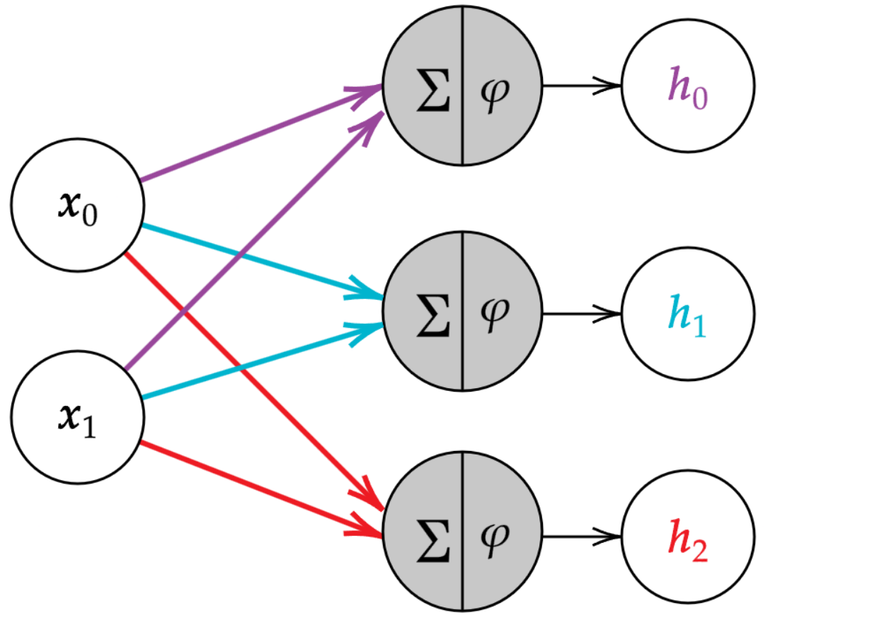
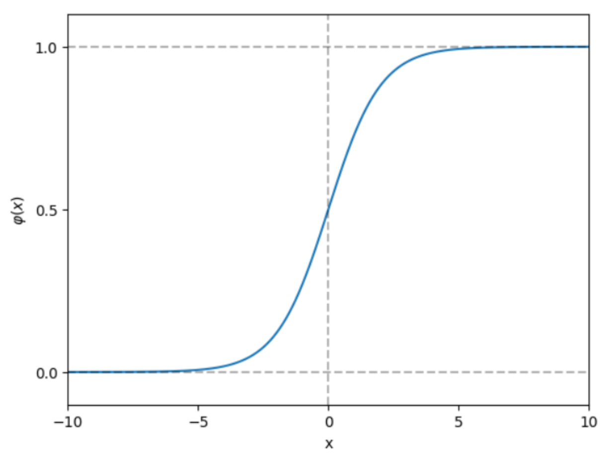
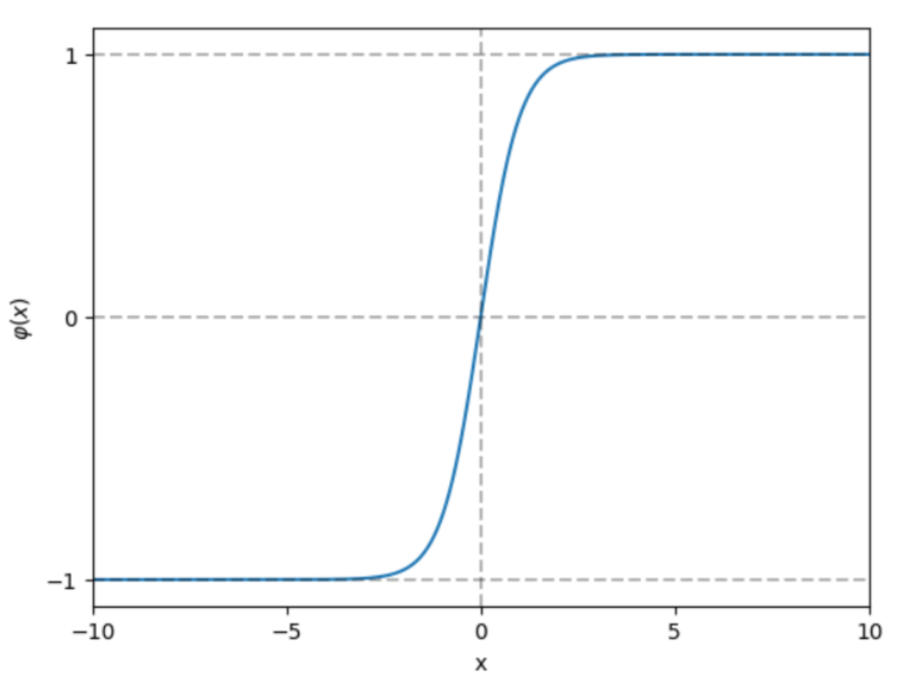
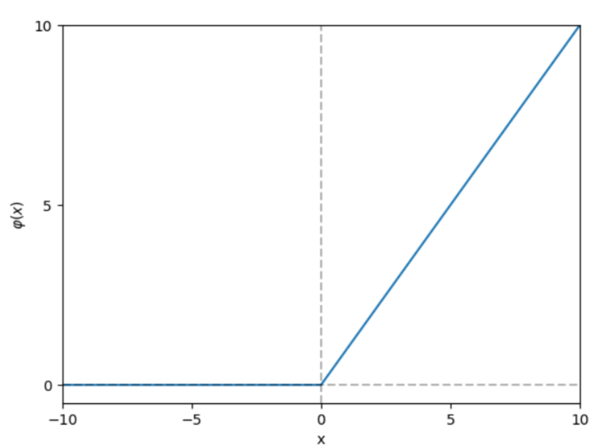

= AI for DH - Artificial Neural Networks
:toc:
:toc-title: Contents
:nofooter:
:stem: latexmath

== Why neural networks

Universal function approximators

* they can approximate any function
* even an MLP can
* RRNs can approximate any dynamic system

Non parametric

* Dont have to make strong assumptions about the probability distribution of data
* i.e. doesn't really care about how the data is distributed

Scalable

* inherently parallelizable

Heavily supported by SW and HW

* GPU support
* Essentially just multiplying and adding stuff

Fast solutions by Lego bricking

* you can compose different modules into a single model
* as long as the functions/neural layers are *differentiable*

=== Neural networks in healthcare

Learn complex patterns from noisy and diverse data (don't care about distribution)

Allows us to integrate multiple types of data (categorical, complex biomedical data, etc.) into a single prediction

Able to handle vast amounts of data

* even if you have a few patients one patient might have 10 morbillion values

=== No free lunch

Not the best for strict interpretability and safety/security requirements

The output is the result of the interaction of many neurons none of which are really specialized

* connectionist system
* difficult to assign a semantic meaning to a single entity
** a single neuron alone is meaningless
* victims of adversarial attacks
** giving it a mangled input to screw with the prediction

Better if there is prior knowledge (especially for CNNs)

* if there are no constraints itll kinda do whatever

Need a LOT of data

== Modeling the artificial neuron

Logistic regression is essentially a neuron

. Taking a bunch of inputs (dendrites)
* features and weights
. Scaling (neuron body)
* summation of product(feature, weight)
. Accumulating (cell)
* sigmoid(summation)
. Outputting (synaptic terminal) 
* Label

=== The artificial neuron

McCulloch and Pitts came up with it in 1943 (lmao)

Their neuron had the following components:

* input stem:[\mathbf{x}]
* synaptic weights stem:[\mathbf{\theta}]
* local potential stem:[net(\mathbf{x}) = \sum_{i=1}^k \theta_i x_i]
** This is the excitation level of the neuron
* activation function stem:[\phi]
** threshold function in this case
* output stem:[\mathbf{y}]

[stem]
++++
y = \phi(net(\mathbf{x})) = \phi \Biggl(\sum_{i=1}^k \theta_j x_j \Biggr)
++++

Only computes an output

=== The Perceptron

Rosenblatt came up with the *perceptron*

* perceptrons can *learn*

[stem]
++++
y = \phi(net(\mathbf{x})) = \phi \Biggl(\sum_{i=1}^k \theta_j x_j \Biggr)
++++

where

[stem]
++++
\phi(net) = \{+1net \ge 0, -1 net \lt 0\}
++++

Weighted summation with step function

This function is non differentiable and too similar to a logistic regression and its limitations

* it can only draw linear separation lines/hyperplanes

[stem]
++++
y = \phi(net(\mathbf{x})) = \sigma \Biggl(\sum_{i=1}^k \theta_j x_j \Biggr)
++++

== Artificial Neural Networks

A single neuron isn't enough

Neurons are connected to do more complex stuff

== Multi Layer Perceptron

3 layers:

. Input layer: feeds in the input vector stem:[\mathbf{x}]
. Hidden layer: transforms stem:[\mathbf{x}] int a new vector representation stem:[h(\mathbf{x})] where len == number of hidden neurons in layer depending on the hidden layer parameters stem:[\mathbf{\theta}^h]
. Output layer: generates prediction stem:[\mathbf{y}] by combining the intermediate representation (i.e. the output of the hidden layer) and its own parameters stem:[\mathbf{\theta}^y]

In *theory* we can approximate any function with MLP (but you need infinite neurons in hidden layer)

* learn any decision boundary (even non linear)

In practice you should have a lot of finite hidden layers

MLPs have parameters stem:[\theta^h] and stem:[\theta^y]

* stem:[\theta^y] are the output layer parameters
* stem:[\theta^y] will be a vector of len == len(hidden_layer)
* stem:[\theta^h] is a matrix with height = len(input) and width = len(weights)

They can learn *any decision boundary* and they are adaptable to *any task* by changing the output layer 

=== Input Layer

Input layer is a copy of the sample

* first item of sample goes to stem:[x_0], second to stem:[x_1] etc.

==== Numerical Features

NNs accept continuous and ordinal values for free

*BUT*

you should normalize data to avoid saturating the neuron

Min-max scaling (be careful - very sensitive to outliers) scales values between stem:[[0, 1\]] and stem:[[-1, 1\]]: 

[stem]
++++
x' = \frac{x - x_{min}}{x_{max} - x_{min}} \rightarrow x' \in [0, 1]

\\

\text{or}

\\

x' = 2 \frac{x - x_{min}}{x_{max} - x_{min}} - 1 \rightarrow x' \in [-1, 1]
++++

CAUTION: use the training set to scale but outliers in the test set can fuck you so xd

Z score standardization subtracts the mean from each value and divides by the standard deviation: 

[stem]
++++
x' = \frac{x-\mu}{\sigma}
++++

* Stick normalization into model selection and pick whichever works best

==== Categorical features

Handling categorical features is also something to watch out for

* NNs don't accept text so we have to encode them
** e.g. green = 0, brown = 1, blue = 2
*** this is bad since the distance between green and brown is smaller than between green and blue
** have to find an encoding where all elements are at equal distance

* Use 1 of k categories (1 hot)

e.g. green = 1 0 0, blue = 0 1 0, brown = 0 0 1

use k size vector where 1 value is 1 and all others are 0

if it's a score then leave them alone (higher better or lower better)

Can also use dense embeddings (better for NLP)

=== Hidden Layer

* Receives inputs 
* multiple neurons
* each does its own calculation
* Basically a function

has parameters stem:[\theta^h]

* hard to generate because no ground truth

Transforms input stem:[x] into vector stem:[h] of arbitrary size -> projects stem:[x] into a different subspace

[stem]
++++

h = g_{\theta^h}(x) \text{ with } g_{\theta^h} \cdot \text{ nonlinear function}

++++

==== Step by step

Where stem:[\phi] is the activation function:

[stem]
++++
h_0 = \phi(\mathbf{\theta}_0\mathbf{x}) = \phi(\theta_{00}x_0 + \theta_{10}x_1)

\\

h_1 = \phi(\mathbf{\theta}_1\mathbf{x}) = \phi(\theta_{01}x_0 + \theta_{11}x_1)

\\

h_2 = \phi(\mathbf{\theta}_2\mathbf{x}) = \phi(\theta_{02}x_0 + \theta_{12}x_1)
++++

Input layer (also input to hidden layer in this case):

* vector stem:[\mathbf{x}] with stem:[k] = 2 features where stem:[\mathbf{x} \in \mathbb{R}^2] space

Output layer:

* stem:[h] with stem:[s] = 3 features -> stem:[\mathbf{h} \in \mathbb{R}^3] space

Sometimes we need to reduce the size of the input:

If stem:[len(\mathbf{h}) \lt \mathbf{x}] -> compression

* good if input stem:[\mathbf{x}] is noisy and/or high dimensional

If stem:[len(\mathbf{h}) \gt \mathbf{x}] -> expansion

* project input into higher dimensional space
** earlier we transformed a 2D input vector into a hidden 3D representation
* Difficult problems in lower dimensional space can become linear problems in higher dimensional space
* More neurons -> more learning capacity (overfit risk)

Linear functions take the input without changing it:

stem:[\phi(\theta_x) = \theta_x] simply returns the input 

* it's basically an identity function

Continuing the previous example:

* stem:[\mathbf{\theta}] is a parameter matrix with stem:[k=2] rows and stem:[s=3] columns

[stem]
++++
\mathbf{\theta} = 

\begin{bmatrix}
2 & 3 & -1 \\
2 & 6 & -8
\end{bmatrix}^T
++++

* stem:[\mathbf{x} = [1 \ -1\]^T] is a sample input vector

Applying the previous equations:

[stem]
++++
h_0 = \phi\biggl([2 \ 2] \begin{bmatrix} -1 \\ 1 \end{bmatrix}\biggr) = \phi(0)

\\

h_0 = \phi\biggl([6 \ 3] \begin{bmatrix} -1 \\ 1 \end{bmatrix}\biggr) = \phi(-3)

\\

h_0 = \phi\biggl([{-8} \ {-1}] \begin{bmatrix} -1 \\ 1 \end{bmatrix}\biggr) = \phi(7)

\\

\mathbf{h} = \phi([0 \ {-3} \ 7])
++++

== Non Linear activation functions

Activation functions must be nonlinear for Neural Networks

They decide whether a neuron should activate or not

=== Sigmoid

[stem]
++++
\phi(\mathbf{\theta x}) = \frac{1}{1+e^{-\mathbf{\theta x}}}
++++

Squashing function that takes input and forces it between 0 and 1

[stem]
++++
\phi([0 \ {−3} \ 7]) = [0.5 \ 0.047 \ 0.999]
++++

* sigmoid is partially linear
* it's also fully positive
** if its going into a second hidden layer we might lose resolution (saturate neuron)
* gradient of sigmoid is generally small
* multiplying small numbers tend to 0 which is bad
** if gradient = 0 we learn nothing

Don't need to be heavily non linear - sigmoid is fine

=== Hyperbolic tangent (htan/tanh)

[stem]
++++
\phi(\mathbf{\theta x}) = 

\frac
{
    e^{\mathbf{\theta x}}
    -
    e^{- \mathbf{\theta x}}   
}

{
    e^{\mathbf{\theta x}}
    +
    e^{- \mathbf{\theta x}}   
}

++++

Squashing function that takes input and forces it between -1 and 1

[stem]
++++
\phi([0 \ {−3} \ 7]) = [0 \ −0.995 \ 0.999]

++++

* better than sigmoid in general
* more linear than sigmoid
* derivatives are nicer

=== Rectified Linear Unit - ReLU

[stem]
++++
\phi(\mathbf{\theta x}) = max(0, \mathbf{\theta x})
++++  

Sets negative values to 0 and doesn't touch the rest

[stem]
++++
\phi([0 \ {−3} \ 7]) = [0 \ 0 \ 7]
++++

ReLU is generally better than Htan and sigmoid - generally default function

It has just the right amount of nonlinearity

Nice gradient properties

* negative section has 0 gradient

WARNING: If we end up in 0 we never leave gradient then our gradient is dead and we learn nothing

=== Softmax

[stem]
++++
softmax_i(\mathbf{z}) = \frac{e^{z_i}}{\sum^{n}_{j=1} e^{z_j}}
++++

Measures the probability of belonging to specific category

transforms a dense vector into a discrete probability vector

output of softmax is predicted vector len d where each item is the probability of x being in that class -> sums to 1

== Output Layer

Results of hidden layer(s) stem:[\mathbf{h}] are composed and a single value is output stem:[y]

has weights/parameters stem:[\mathbf{\theta}^y] that are learned during training and used in the parametrized function: 

[stem]
++++
y = g_{\theta^y}(\mathbf{h})
++++

also has a task specific loss function and activation function

=== Binary classification

Classifiying input stem:[\mathbf{x}] into class stem:[y \in [0, 1\]]

Use sigmoid as output layer activation function

weighted sum of stem:[h_i] into sigmoid

[stem]
++++
\hat{y} = \sigma(\mathbf{\theta}^y \mathbf{h})
++++

compare stem:[\hat{y}] with stem:[y] using BCE loss:

[stem]
++++
BCE(\hat{y}, y) = -y log(\hat{y}) + (1-y)log(1-\hat{y})
++++

=== Multiple binary classification

Predict d-dimensional vector stem:[\mathbf{y}] of 1 and 0 for a sample stem:[\mathbf{x}]

* Output is vector stem:[\mathbf{y} \in [0, 1\]^d]
* Apply sigmoid for each dimension: stem:[\hat{y} = \sigma(\mathbf{\theta}^y \mathbf{h})]

Use average BCE for loss

==== Multiclass labeling

Also ok for multiclass labeling

Like for tagging documents

* a document can have multiple tags
* an image can have multiple tags

=== Multiclass classification 

Input stem:[x] needs to be one of d classes (*only one*)

Have to train with competition in mind -> only one should win

1 output neuron for each class in stem:[D] where stem:[D = \{d_1, d_2, \dots, d_d\}]

if stem:[x] in class stem:[d_5] -> output ground truth is vector stem:[[0, \dots, d\]] where all 0 except vec[5]

Using independent sigmoids is bad becaues there is no competition between predictions

use softmax to generate the output

where stem:[\mathbf{\theta}] is the stem:[z] parameter (linear combinations from output neurons) and stem:[\hat{y}] is the output vector of the softmax

if y[5] corresponds to idx(max(yhat[5])) then we are chilling

Use cross entropy loss

=== Regression

Linear functions are fine for regression problems

Can combine with htan or sigmoid if output needs to be within some range

Use MSE loss

=== Multiple regression

Predict a vector of real values stem:[\mathbf{y} \in \mathbb{R}^d] in response to sample stem:[\mathbf{x}]

As many output neurons as there are outputs

* i.e. len(stem:[\mathbf{y}]) linear combinations of stem:[\mathbf{h}]

Use identify function as activation

* it allows the output to be any value (i.e. not bound by a set or probability distribution)

Sum of MSE for each output dimensions -> take mean error of output

== Training an Artificial Neural Network

=== Batched learning

Figure out hidden layer parameters and output layer parameters

For epoch in epochs:

shuffle training set

For each subsample B of pairs stem:[(\mathbf{x}^B, y^B)] from shuffled training set: 

. compute prediction stem:[MLP_\theta(\mathbf{x}^B)]
. compute loss stem:[L] of stem:[MLP_\theta(\mathbf{x}^B)] compared to true labels stem:[y^B]
. compute gradient of loss stem:[\mathbf{\nabla_\theta L}]
* easy for output layer cuz have ground truth
* hard for hidden layer cuz no ground truth (backpropagation)
. update ALL parameters
* stem:[\mathbf{\theta}_{new} = \mathbf{\theta} - \eta \mathbf{\nabla_\theta L}]
. use ALL updated parameters in next iteration
* stem:[\mathbf{\theta} = \mathbf{\theta}_{new}]

gradient is the average of each subsample/batch

=== Backpropagation

Use chain rule to compute gradient from output to hidden layer

Compute prediction error from output layer -> propagate error backwards through the same path

stem:[\nabla Hl] = local information from layer

stem:[\nabla_\theta H_h] = gradient computed from output layer

=== Convergence Criteria

Learning is done by iteratively giving the model shuffled trainingdata and adjusting by backprop

* 1 presentation == 1 epoch

When do we stop?

*Early stopping*

Monitoring validation error isn't enough cuz local minima exist LOL

* can have a patience hyperparameter that decides how many epochs before stopping or something