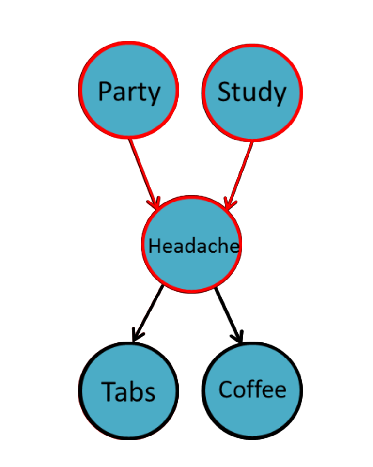

= AIDH - Intro to Bayesian Networks
:toc:
:toc-title: Contents
:nofooter:
:stem: latexmath

== Bayesian Networks

ML models that represent knowledge learned from data as probabilities

Can be used to generate data (probability distributions)

Usable for:

* supervised tasks
* unsupervised tasks
* weakly supervised learning tasks

Since modern tasks have large numbers of variables modeling the joint distribution of all variable can be impractical

* Parameter space grows exponentially
* Computationally impractical to train and predict

=== Graphical Framework for Bayesian Networks

Representation

* BNs can be used to represent exponentially large probability distributions in a compact way and to encode assumption of conditional independence

Inference

* How do we query/predict with a Bayesian Network?

Learning

* Fitting parameters associated with the model's probability distribution

They can be represented as graphs where:

* Nodes/vertices are random variables
* Edges between nodes/vertices represent probabilistic relationships

== Graphical Representation

BNs can be represented as Directed Acyclic Graphs (DAG) stem:[\mathcal{G} = (\mathcal{V}, \epsilon)]

Where:

* nodes stem:[\mathcal{v} \in \mathcal{V}] represent random variables
* edges stem:[e \in \epsilon] describe the conditional independence relationships

Conditional Probability Tables (CPTs) local to each node describe the probability distribution given its parents

[stem]
++++
P(Y_1, \dots, Y_N) = \prod_{i=1}^N P(Y_i | pa(Y_i))
++++

For example:

Given node stem:[Y_1]

.Single node PCT
["1, 1"]
|===
|stem:[Y_1] |stem:[P(Y_1)]

|False
|0.6

|True
|0.4

|===

and nodes stem:[[Y_1, Y_3\]]:

.Two node PCT
["4, 3"]
|===
|stem:[Y_1] |stem:[Y_2] |stem:[P(Y_3 \| Y_1)]

|False
|False
|0.4

|False
|True
|0.6

|True
|False
|0.9

|True
|True
|0.1

|===

== Causality vs Dependence

We can't say if relationships are causal but generally they are not

Bayesian Networks represent statistical dependence

Under further assumptions this dependence may coincide with causal dependence

== Local Markov Property

The local Markov Property is defined as follows:

.Local Markov Property
****
Each node (i.e. random variable) is conditionally independent of all its non-descendants given a joint state of its parents

[stem]
++++
Y_\mathcal{v} \bot Y_{\frac{V}{ch(\mathcal{v})}} | Y_{pa} \forall \mathcal{v} \in V
++++
****

Given this graph:

Party and Study are _marginally_ independent (knowing one does not inform about the other)

* stem:[Party \bot Study]

The local Markov Property does not support:

* stem:[Party \bot Study | Headache]
* stem:[Tabs \bot Party]

Party and Tabs are independent given headache

* meaning that if you take headache tabs because of your headache we can't know if you went to a party or studied all night

== Joint Probability Factorization

Let stem:[L] be the maximum number of ingoing edges in a BN

stem:[\therefore] the number of parameters is at most stem:[N \cdot (k-1)^L]

stem:[\therefore] the sparser the network -> the less complex the parameters

We can use the chain rule to factorize the joint probability of the Local Markov Property: 

. Pick a topological ordering of nodes (i.e. assign them an order)
. Apply chain rule to probabilities following the order
. Use the conditional independence assumptions

[stem]
++++
𝑃 (𝑃𝐴, 𝑆, 𝐻, 𝑇, 𝐶) = 𝑃(𝑃𝐴) \cdot 𝑃(𝑆 | 𝑃𝐴) \cdot 𝑃 (𝐻 | 𝑆, 𝑃𝐴) \cdot 𝑃(𝑇 | 𝐻, 𝑆, 𝑃𝐴) \cdot 𝑃( 𝐶 | 𝑇, 𝐻, 𝑆, 𝑃𝐴) = 𝑃(𝑃𝐴) \cdot 𝑃(𝑆) \cdot 𝑃(𝐻 | 𝑆, 𝑃𝐴) \cdot 𝑃(𝑇|𝐻) \cdot 𝑃(𝐶 | 𝐻)
++++

== (Ancestral) Sampling of a BN

BNs describe generative processes for observations

. Pick a topological ordering of nodes (again)
. Generate data by sampling from the local conditional probabilities while following this order

In our case we generate the stem:[i]th sample for each variable PA, S, H, T, C:

. stem:[pa_i \sim P(PA)]
. stem:[s_i \sim P(S)]
* because they are independent of anything we can just approximate their probability
. stem:[h_i \sim P(H | S = s_i, PA = pa_i)]
. stem:[t_i \sim P(H | H = h_i)]
. stem:[c_i \sim P(C | H = h_i)]
