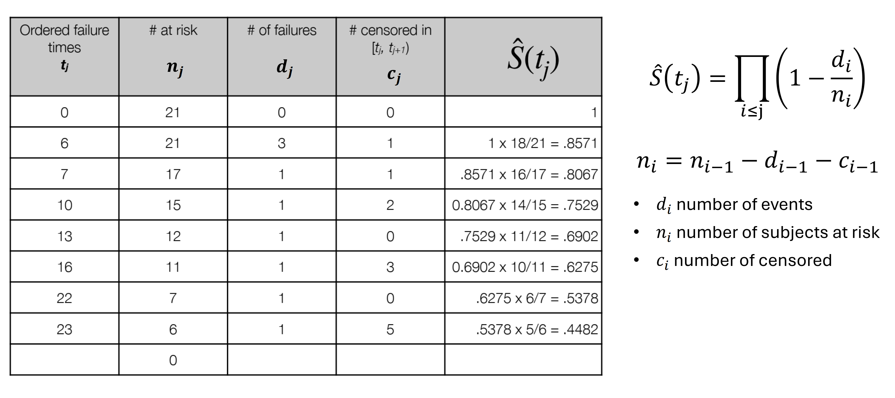

= AIDH - Survival Analysis
:toc:
:toc-title: Contents
:nofooter:
:stem: latexmath

== Survival Analysis as a regression problem

Estimating time to event based on patient features

=== Time to Event Outcomes

Main outcome of interest is stem:[T]: time until an event occurs

* Time is just time (days, weeks, months, years, etc.) from the last patient visit (or the first visit) until the Event
* Event: any experience that may happen to an individual (death, disease, relapse, recovery, etc.)

For example:

* Leukemia patients/time in remission (weeks)
** Jimmy has (had) leukemia and we estimate remission duration of 3 weeks
* Healthy cohort/time until heart disease (years)
** Bobert has no known conditions but hes approaching 70 so we estimate that when he hits 70 he has a chance of heart disease
* Heart transplants/time until death (months (lmao))
** Hank had a heart transplant but his body seems to be rejecting it. We estimate he will die in 9 months if we don't intervene

=== Right Censoring

When we have some information about individual survival time but we don't know the exact time

3 main reasons:

. Subject does not experience the Event before the study ends
* The study ends the day Bobert turns 70 and he doesn't have a heart attack
* He might have a heart attack when he hits 71 but this will not be reflected in the study
. Subject is lost to follow up during the study
* Hank shows up at T0, T1 and T2 but decides to stop before T3
. Subject withdraws from the study because they die (if death is not the event of interest) or some other competing risk forces them (e.g. drug reaction, whatever)
* The study measures average remission time for leukemia patients but Jimmy dies before the end of the study (RIP)

== Survival Function Estimation

There are functions used to estimate survival time

They can be built on multiple datasets:

* Populations
** Patients with leukemia
* Subgroups
** Males with leukemia/people older than 50 with leukemia
* Single patients
** parametrizing them with things I know about the patient

=== Terminology and Notation

* stem:[T \ge 0]: random variable for a subject survival time

* stem:[t] is a specified value of time

* stem:[f(t)] density function of stem:[T]
* stem:[F(t)] cumulative density function (aka failure function) of stem:[T]

[stem]
++++
F(t) = P(T \leq t) = \int^{t}_{0} f(\tau) d \tau
++++

Where:

* stem:[F(t)] is the cumulative density at time stem:[t]
* stem:[P(T \leq t)] is the probability that event occurs before time stem:[t]
* stem:[\int^{t}_{0} f(t) dt] is the area under the curve at time stem:[t]
** i.e. the probability of the event occurring before time stem:[t]

=== Survival/Survivor Function

In survival analysis we want the inverse, i.e. the probability that the event hasn't occurred and that the subject survives beyond time stem:[t]:

.Survival function:
[stem]
++++
S(t) = P( T \gt t ) = \int^{\infty}_{t} f(\tau) d \tau = 1 - F(t)
++++

Where:

* stem:[1 - F(t)] is the area without the probability of event occurring starting at time stem:[t] and beyond

The ideal survival function is:

* Monotonic
* Non increasing
* Equals 1 at time 0
* Decreases to 0 as time approaches infinity

More realistic survival functions look like steps:

* Measurements are taken at intervals (T0, T1, T2)
* Study periods are never infinite in length
* Estimated survivor function may not reach 0 by the end of the study

=== Hazard Function

Hazard stem:[h(t)] is the instantaneous probability per unit time that an event occurs _exactly_ at time stem:[t] given that the patient has survived at least until time stem:[t]

Generally used to build survival models

.Hazard Function
[stem]
++++
h(t) = \lim_{\Delta t \rightarrow 0}
\frac{

P(t \leq T \lt t + \Delta t

 \
|\ T \geq t)}

{\Delta t}
++++

Where:

* stem:[P(t \leq T \lt t + \Delta t \ | \ T \geq t)] is the probability that event stem:[T] is between stem:[t] and stem:[t+\Delta t]
** where stem:[\Delta t] is the next time step
** stem:[\Delta t] should be as small as possible

Also known as velocity of the failure function or conditional failure rate

* produces ratios in range stem:[[0, \infty)]
* depends on time unit being used (days, weeks, months, etc.)

There is also the *cumulative hazard function* that integrates the hazard function

* it measures the cumulative risk between 0 and time stem:[t]

.Cumulative Hazard
[stem]
++++
H(t) = \int^{t}_{0} h(\tau) d\tau
\\
\text{  such that  }
\\
S(t) = \exp(-H(t))
++++

Where:

* stem:[H(t)] is cumulative hazard up to time stem:[t]
* stem:[\int^{t}_{0} h(\tau) d\tau] gives the risk value at each time stem:[t_n]
** gives total risk between 0 and time stem:[t]
* stem:[S(t)] is the chance of survival at time stem:[t]

== Baseline Survival Estimators

We can compute the average or median time for our reference populations:

* Mean survival time of placebo group = stem:[\frac{182}{21} = 8.7] weeks
* Mean survival time of treatment group = stem:[\frac{359}{21} = 17.1] weeks

Censored subjects are ignored

* Might have been in remission for longer
* Underestimates their remission duration

=== Average Hazard Rate

To account for censoring we can use the average hazard rate:

.Average Hazard Rate
[stem]
++++
\bar{h} =
    \frac
    {\sum_j \delta_j}
    {\sum_j T_j}
++++

Where stem:[\delta] is 1 if the outcome occurred or 0 if it is censored

=== Kaplan-Meier Method

Non parametric survival estimator

Since it's non parametric it can get things _really_ wrong

Low confidence estimator

.Kaplan-Meier (Recursive)
[stem]
++++
\hat{S}(t_j) = P(T \gt t_j) = \hat{S}(t_{j-1}) \cdot P(T \gt t_j | T \gt t_{j-1})
++++

Where:

* stem:[\hat{S}(t_j)] is the predicted survival rate at time stem:[t_j]
* stem:[P(T \gt t_j)] is the probability that event time stem:[T] is after time stem:[t_j]
* stem:[\hat{S}(t_{j-1})] is the predicted survival rate at the previous time step
* stem:[P(T \gt t_j | T \gt t_{j-1})] is the probability that event time stem:[T] is after current time stem:[t_j] given that event time stem:[T] is after the previous time step

Meaning:

* Survival probability at time stem:[t_j] is a product of the same estimate up to the previous time stem:[t_{j-1}] and the observed survival rate at stem:[t_j]

It can be expressed iteratively as well:

.Kaplan-Meier (Iterative)
[stem]
++++
\hat{S}(t_j) = \prod_{i \leq j} (1 - \hat{h}_j) = \prod_{i \leq j} (1 - \frac{d_i}{n_i})
\\
\text{ where } n_i = n_{i-1} - d_{i-1} - c_{i-1}
++++

Where:

* stem:[\hat{h}_i] is the estimated hazard ratio at time stem:[j]
* stem:[d_i] is the number of events at time stem:[t_i]
* stem:[n_i] is the number of subjects at risk at time stem:[t_i]
* stem:[c_i] is the number of censored subjects

For example:

. stem:[\hat{S}(t_j)] is 1 at time 0 because it's a product of itself (nothing comes before it) and stem:[d_j] is 0, therefore the division returns 0, and 1-0 is 1
. at stem:[j=6] 21 people are at risk because current number of people is number of people minus the number of failures minus censored *_at the previous step_*
* stem:[n_{i=6} = 21 - 0 - 0 = 21]
* stem:[d_{i=6} = 3]
** there are 3 failures in column stem:[d_{j=6}]
* therefore stem:[1 - \frac{3}{21} = 1 - \frac{1}{7} = \frac{18}{21}]
* and therefore stem:[\hat{S}(t_{j=6}) = 1 \cdot \frac{18}{21}]

== Treatment vs Placebo Survival

=== Confidence intervals for survival curves

Kaplan-Meier gives you the mean, but to get the confidence intervals we need the variance

Greenwood's formula is a common method for directly estimating the confidence interval of the log survival function

.Greenwood's formula for log survival
[stem]
++++
Var(\log \hat{S}(t_j)) = \sum_{i \leq j} \frac{d_i}{n_i (n_i - d_i)}
++++

This formula computes the variance of the logarithm of the estimated survival rate at time stem:[j]

.Greenwood's formula for non log survival
[stem]
++++
\hat{S}(t_j) = z \sqrt{ \hat{S}(t_j)^2 \sum_{i \leq j} \frac{d_i}{n_i (n_i - d_i)}}
++++

Where:

* stem:[z] is the normal quantile corresponding to the confidence level
** e.g. stem:[z = 1.96] for 95% confidence

The confidence interval grows with time as the data becomes more sparse (people die or leave the study for other reasons)

=== Comparing Survival Curves

Consider a group variable which divides the population into stem:[G] groups: assess the association between grouping and survival at each time stem:[t_j]

Say stem:[G = 2] (placebo and treatment), the expected number of events in group 1 at time stem:[t_j] is:

[stem]
++++
e_{1j} = \frac{n_{1j}}{n_{1j} + n_{2j}} (d_{1j} + d_{2j})
++++

Where:

* stem:[g] is the group
** For stem:[G = 2] -> stem:[g \in \{1, 2\}]
* stem:[n_{gj}] is the number of subjects in group stem:[g] at time stem:[t_j]
** similar to stem:[d_{gj}] where stem:[d] denotes the number of events
* stem:[n_{1j} + n_{2j}] is the total number of people in the population
* stem:[d_{1j} + d_{2j}] is the total number of events in both groups

We ask:

* is there a difference between the observed number of events and the expected number of events if we expect no difference between the 2 groups?

the log-rank test statistic is:

[stem]
++++
Z = \frac{(O_g - E_g)^2}{Var(O_g - E_g)}
\\
\text{with: }
\\
O_g = \sum_j d_{gj}
\\
E_g = \sum_j e_{gj}
++++

Where:

* stem:[O_g] is the observed number of events
* stem:[E_g] is the expected number of events

when under stem:[H_0] (no difference) -> stem:[Z \sim \chi^2]

== Cox Proportional Hazards Model

Semi parametric regression model

Takes into account effect of covariates in addition to the baseline hazard

.Cox Proportional Hazards Formula
[stem]
++++
h_i(t) = h_0(t)\exp(\mathbf{\theta x}_i)
++++

Where:

* stem:[h_i(t)] is the hazard of subject stem:[i] at time stem:[t]
* stem:[h_0(t)] is the baseline hazard shared between subjects
* stem:[\mathbf{\theta}] are the regression coefficients
* stem:[\mathbf{x}] are the covariates associated with a patient

Cox assumes that stem:[\mathbf{x}] are *_time invariant_*

If we integrate the hazard potential (the thing above) we get the cumulative hazard

.Cumulative Hazard
[stem]
++++
H_i = H_0(t) \exp{\mathbf{\theta x}_i}
    = \int^{t}_{0} h_0 (\tau) d \tau \exp{\mathbf{\theta x}_i}
++++

At this point stem:[H_i] isn't the probability of dying but rather a measure of accumulated risk that can be related to probability using the survival function

The survival function is therefore

.Survival Function
[stem]
++++
S_i(t) = \exp{(H_0(t) \exp({\mathbf{\theta x}_i}))}

= S_0(t)^{\exp({\mathbf{\theta x}_i})}
++++

where the baseline survival function is:

.Baseline Survival Function
[stem]
++++
S_0(t) = \exp({H_0(t)})
++++

=== Estimating the Cox model

2 steps:

. Estimating the cumulative baseline hazard (what is everyone's risk at time 0) (nonparametric)
. Fit the regression parameters stem:[\mathbf{\theta}]

Use the *Breslow estimator*

.Breslow Estimator
[stem]
++++
H_0(t_j) = \sum_{l \leq j} \hat{h}_0 (t_l)

\\
\text{ where }
\\

\hat{h}_0 = \Biggl\{
    \Biggl(
        \sum_{i \in R_j}  (\exp (\mathbf{\theta x}_i))
    \Biggr)
    ,
    0

++++

i.e. the sum of the estimated baseline risk until time stem:[l] where stem:[l \leq j] if stem:[t_j] is a time, otherwise return 0

where:

* stem:[R_j] is the set of subjects at risk at time stem:[t_j]
* stem:[\mathbf{x}_i] is the vector for the subject experiencing the outcome at time stem:[t_i]

Regression parameters stem:[\mathbf{\theta}] are derived by minimizing a loss function stem:[\mathcal{L}] (classic gradient descent moment)

The specific loss function is *log-partial likelihood*

.Log-partial likelihood
[stem]
++++
\mathcal{L}(\mathbf{\theta}) =

\sum^{N}_{j=1} \delta_j

\Biggl(
        \mathbf{\theta x}_j
        -
        \log \Biggl(
            \sum_{i \in R_j} \exp(\mathbf{\theta x}_i)
        \Biggr)
\Biggr)
++++

This function can be regularized with L1 and L2 methods

=== Time-dependent Cox model

We can relax the assumption that stem:[\mathbf{x}] are time invariant if necessary

This requires updating the formula:

.Time-dependent Cox Model
[stem]
++++
h_j(t) = h_0(t) \exp

    \Biggl(
        \sum^{K1}_{k=1} \theta_k x_{ik}(t)
        +
        \sum^{K2}_{k'=1} \theta_{k'} x_{ik'}(t)
    \Biggr)
++++

Where:

* stem:[\theta_k] are time dependent parameters
* stem:[x_{ik}] are time dependent features
* stem:[\theta_{k'}] are time invariant parameters
* stem:[x_{ik'}] are time invariant features
