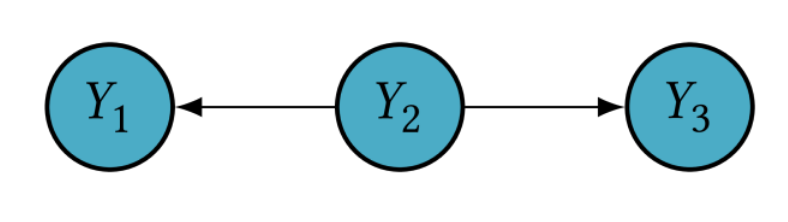
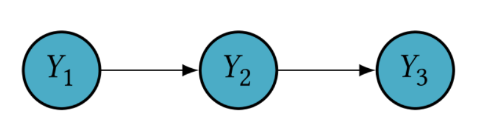
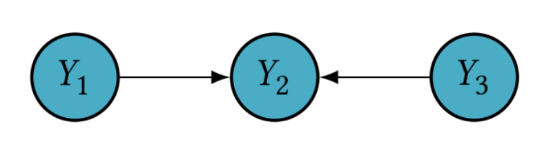

= AIDH - Bayesian Networks
:toc:
:toc-title: Contents
:nofooter:
:stem: latexmath

== Fundamental BN structures

There are 3 fundamental substructures that determine the conditional independence relationships in a BN

=== 1. Tail-to-tail

Also known as fork and common cause

Corresponds to:

[stem]
++++
P(Y_1, Y_3 | Y_2)P(Y_2) = P(Y_1 | Y_2) P(Y_3|Y_2) P(Y_2)
++++

If stem:[Y_2] is unobserved then stem:[Y_1] and stem:[Y_3] are marginally dependent

[stem]
++++
Y_1 \not\bot Y_3
++++

* this means that even if you don't know the exact value of stem:[Y_2] you can make an educated guess on the relationship between stem:[Y_1] and stem:[Y_3] because they come from the same source

However if stem:[Y_2] is observed then stem:[Y_1] and stem:[Y_3] are conditionally independent

[stem]
++++
Y_1 \bot Y_3 | Y_2
++++

* This means that stem:[Y_1] and stem:[Y_3] no longer depend on a possible relationship between them but rather on the known value of stem:[Y_2]

When stem:[Y_2] is observed it is said to be *blocking the path* from stem:[Y_1] to stem:[Y_3]

=== 2. Head-to-tail

Also known as chain and causal effect

Corresponds to:

[stem]
++++
P(Y_1, Y_2, Y_3) = P(Y_1) P(Y_2 | Y_1) P(Y_3 Y_2) = P(Y_1|Y_2) P(Y_3|Y_2)P(Y_2)
++++

If stem:[Y_2] is unobserved then stem:[Y_1] and stem:[Y_3] are marginally dependent:

[stem]
++++
Y_1 \not\bot Y_3
++++

* meaning that there may or may not be a relationship between them

If stem:[Y_2] is observed then stem:[Y_1] and stem:[Y_3] are conditionally independent

[stem]
++++
Y_1 \bot Y_3 | Y_2
++++

* meaning that since there is a known relationship with stem:[Y_2] stem:[Y_1] and stem:[Y_3] can no longer depend on each other directly

Again, observed stem:[Y_2] *blocks the path* from stem:[Y_1] to stem:[Y_3]

=== 3. Head-to-head

Also known as collider and common effect

Corresponds to:

[stem]
++++
P(Y_1, Y_2, Y_3) = P(Y_1)P(Y_3)P(Y_2 | Y_1, Y_3)
++++

If stem:[Y_2] is observed then stem:[Y_1] and stem:[Y_3] are conditionally dependent

[stem]
++++
Y_1 \not\bot Y_3 | Y_2
++++

* This means that if we know the value of stem:[Y_2] there must be a relationship between stem:[Y_1] and stem:[Y_2] because they point to the same node

If stem:[Y_2] is unobserved then stem:[Y_1] and stem:[Y_3] are marginally independent

[stem]
++++
Y_1 \bot Y_3
++++

* This means that if we don't know the value of stem:[Y_2] we can't make any assumptions about the relationship between stem:[Y_1] and stem:[Y_3]

If any descendants of stem:[Y_2] are observed then the path is unlocked

== Blocked Paths

Let stem:[r = (Y_1 \leftrightarrow \dots \leftrightarrow Y_2)] be an undirected path between stem:[Y_1] and stem:[Y_2]

r is blocked by set stem:[Z] if one of the following holds:

* r contains a fork (tail to tail) stem:[Y_i \leftarrow Y_c \rightarrow Y_j] such that stem:[Y_c \in Z]
* r contains a chain (head to tail) stem:[Y_i \rightarrow Y_c \rightarrow Y_j] such that stem:[Y_c \in Z]
* r contains a collider (head to head) stem:[Y_i \rightarrow Y_c \leftarrow Y_j] such that neither stem:[Y_c] nor its descendants are in stem:[Z]

=== d Separation

stem:[r] is d-separated by stem:[Z] if there is at least one node stem:[Y_c \in Z] for which path stem:[r] is blocked

Meaning:

* give me a path to block and stem:[n] candidate nodes
** if one of these blocks path stem:[r] then stem:[r] is d-separated by stem:[Z]

Or more formally:

Two nodes stem:[Y_i] and stem:[Y_j] in a BN stem:[\mathcal{G}] are said to be d-separated by stem:[Z \subset \mathcal{V}] (denoted by stem:[Dsep_{\mathcal{G}}(Y_i, Y_j | Z)]) *IF AND ONLY IF* all undirected paths between stem:[Y_i] and stem:[Y_j] are d-separated by stem:[Z]

[stem]
++++
Y_1 \bot_{\mathcal{G}} Y_2 | Z
++++

Take every undirected path between 2 notes and state your stem:[Z] (random variables to check if they separate the node)

If you block all paths -> nodes are d-separated

Meaning that the 2 nodes are conditionally independent given Z

=== Markov blanket

Big network but we focus on a single node stem:[Y]

Find smallest number of nodes to d-separate stem:[Y] from the rest of the network

stem:[Mb(Y)] shields stem:[Y] from the rest of the network

In a Bayesian Network stem:[Mb(Y)] contains:

* stem:[Parents(Y)]
* stem:[Children(Y)]
** if I have an effect I can have info about the cause
* stem:[Parents(Children(Y))]
** if shared effect is observed Y becomes dependent

This allows us to deterime and predict the behavior of a node

Thus we don't have to assign values to all nodes, the nodes in the Markov blanket

The behavior of a node can be completely determined and predicted from its Markov blanket

[stem]
++++
P(Y | Mb(Y), Z) = P(Y | Mb(Y)) \forall Z \notin Mb(Y)
++++

This means that the joint probability of Y given its Markov blanket and Z is the same as the joint probability of Y given its Markov blanket for all Z (random variables) that are not in Y's Markov blanket

== Learning in Bayesian Networks

Changes depending on assumptions we make (ofc)

Fixed variables 

* we know there are n variables but we don't know how they're connected

Complete

* only works if we have ground truth

Incomplete

* we don't have ground truth for some neurons

Naive Bayes basically counts frequencies

* Parameter learning

Non Naive Bayes does funny things:

* Structure Learning needs to use unobservable values to learn

=== Learning Parameters on a Simple Bayesian Network

Given this information about a model:

* Full observability
* Known structure

Where stem:[(x_1, x_2, x_3, \dots)] are input features (age, gender, height, blood pressure etc.)

and stem:[C] is the class to predict

* e.g. patient outcome (probability of heart disease, probability of cancer etc.)

Naive independence assumes that input features stem:[X_i] are independent

[stem]
++++

P(C, X_1, \dots, X_n) = P(C) \prod^{N}_{i=1} P(X_i | C)

++++

Learning means finding values of stem:[P(C)] and stem:[P(X_i | C)] for all stem:[i]

* i.e. for every feature find the probability of that feature given the class
* use that to find the probability of being in a given class

For binary classification you can use the Bernoulli distribution

* it maps success rate given input stem:[p \in [0 \dots 1\]]

=== Maximum Likelihood Learning

consider stem:[N] traning pairs stem:[\mathbf{d} = \{ (\mathbf{x}_n, c_n) \}_{n = 1:N}] such that stem:[\mathbf{x_n} \leq x_{1n}, \dots, x_{Ln} \gt]

Given input stem:[x] and label stem:[C]

Model likelihood for Naive Bayes models on discrete data is the probability of the data stem:[\mathbf{d}] given model parameters stem:[\theta = \{P(C), P(X_1 | C), \dots, P(X_L | C)\}]

Assessment of probability of seen data through eyes of model (what)

Boils down to finding the argmax of the following function w.r.p to parameters:

[stem]
++++
P(\mathbf{d} | \theta) = \prod^{N}_{n=1}P(c_n)\prod^{L}_{i=1}P(x_{in} | c_n)
++++

CAUTION: can easily overfit so use all kinds of regularization

We use gradient ascent to maximize likelihood

Simple Naive Bayes models are generally easy to optimize and often have closed form solutions:

[stem]
++++
\theta^* = max(log(P(\mathbf{d} | \theta)))_\theta
++++

==== Example of NBLRs

stem:[N(k)] = number of samples in class stem:[k]

stem:[N_{is}(k)] = number of samples in class stem:[k] where attr stem:[i] has value stem:[s]

[stem]
++++
P(C = k) = \frac{N(k)}{N}
++++

Proportion of items stem:[\in k] in whole sample

[stem]
++++
P(X_i = s | C = k) = \frac{N_{is}(k)}{\sum^{S_l}_{s=1} N_{is}(k)}
++++

probability that stem:[i]th attr has value stem:[s] knowing that we are in class stem:[C] 

For test input compute probabilty for all stem:[C] and return highest stem:[C]

Basically Bayes' theorem

[stem]
++++
P(C | X) = \frac{P(X | C) P(C)}{P(X)} 
++++

unless X is not class dependent in which case we can discard it

[stem]
++++
P(C | X) = P(X | C) P(C) 
++++

Works as long as network doesnt have unobservable variables (even very big and complex networks)

=== Bayesian networks and Hidden Variables

Introduced to explain complex relationships between observed data in simple ways

* equivalent of a hidden neuron
* like a hidden neuron we don't know what it is exactly

stem:[Z] is var that is unobserved at training time

* stem:[Z] is therefore a *cluster*

This is a *clustering model*

[stem]
++++
P(X_1, \dots, X_L) \approx \sum_{z}P(Z) \prod^{N}_{i=1}P(X_i | Z)
++++

This expression is related to the concept of *marginalization* and *conditional independence* in the context of Bayesian networks, particularly when dealing with hidden variables

Where:

- stem:[P(X_1, \ldots, X_L)]: The joint probability distribution over the observed variables stem:[X_1, \ldots, X_L].
- stem:[Z]: A hidden (or latent) variable.
- stem:[P(Z)]: The prior probability distribution over the hidden variable stem:[Z].
- stem:[P(X_i | Z)]: The conditional probability of the observed variable stem:[X_i] given the hidden variable stem:[Z].

The expression can be interpreted as follows:

. *Summation over Hidden Variable stem:[Z]*:
- The summation stem:[\sum_z] indicates that we are marginalizing over the hidden variable stem:[Z]. This means we are considering all possible values of stem:[Z] and summing their contributions to the joint probability of the observed variables.

. *Prior Probability stem:[P(Z)]*:
- stem:[P(Z)] is the prior probability of the hidden variable stem:[Z]. It represents our belief about the distribution of stem:[Z] before observing any data.

. *Conditional Probabilities stem:[P(X_i | Z)]*:
- stem:[P(X_i | Z)] is the conditional probability of the observed variable stem:[X_i] given the hidden variable stem:[Z]. This represents how the value of stem:[Z] influences the value of stem:[X_i].

. *Product of Conditional Probabilities*:
- The product stem:[\prod_{i=1}^N P(X_i | Z)] assumes that the observed variables stem:[X_1, \ldots, X_L] are conditionally independent given the hidden variable stem:[Z]. This means that once we know the value of stem:[Z], the observed variables do not provide any additional information about each other.

This expression is often used to model the joint distribution of observed variables when there are hidden variables involved. The hidden variable stem:[Z] can represent some underlying factor that influences the observed variables stem:[X_1, \ldots, X_L].

- *Hidden Variable stem:[Z]*: Acts as a common cause or factor that explains the dependencies among the observed variables.
- *Conditional Independence*: Given stem:[Z], the observed variables are independent of each other. This simplifies the joint probability calculation.

Consider a Bayesian network where stem:[Z] is a hidden variable that influences multiple observed variables stem:[X_1, \ldots, X_L]. For example, stem:[Z] could be a disease status (hidden), and stem:[X_1, \ldots, X_L] could be symptoms (observed). The expression tells us how to compute the joint probability of the symptoms by marginalizing over the disease status.

This formulation is useful in various applications, such as:
- *Mixture Models*: Where stem:[Z] represents the mixture component.
- *Latent Variable Models*: Such as Hidden Markov Models (HMMs) or Latent Dirichlet Allocation (LDA) in topic modeling.

*TLDR* the expression stem:[P(X_1, \ldots, X_L) \approx \sum_z P(Z) \prod_{i=1}^N P(X_i | Z)] describes how to compute the joint probability of observed variables by marginalizing over a hidden variable, assuming conditional independence given the hidden variable.

Since stem:[Z] is unobserved we don't have ground truth to compare it to, so we need to make probabilistic hypotheses on stem:[Z] to learn stem:[\theta]

== Bayesian Networks in Healthcare

=== Why BNs in Healthcare

Determine likelihood of pneumonia given cough, fever, difficulty breathing

We aren't 100% sure that patient has pneumonia

* we are dealing with uncertain data

We also know that some symptoms are connected with the outcome

* fitting prior knowledge

We want X knowing Y

* conditional probability query

How did we get here?

* Interpretability
** isolate risk factors/predictors using Markov Blanket

Studying symptom co-occurrence in patients with advanced cancer

To characterize a single symptom you can select things other symptoms that are directly connected to that symptom or symptoms that are parents of those other symptoms

e.g. given fatigue and dysphagia what is the most likely symptom to appear? use inference

* try shortness of breath = [0, 1] and see if something changes

don't need to do it on all variables, just Markov blanket

=== Subpopulations in Bayesian Networks

Datasets are often collected from different sources

This can become a confounding factor because variance in data can come from differences in collection methods and whatnot

==== Multilevel BNs

Hierarchical models

. Indicator variables
* Split population into subpopulations

Use to split practices away from actual data

Useful to cancel out subgrouping effects

==== Modular BNs

Split BN into coarser representation to make it simpler (e.g. genetics)

Collapse n random variables into single random variable which you can later expand to fiddle around with