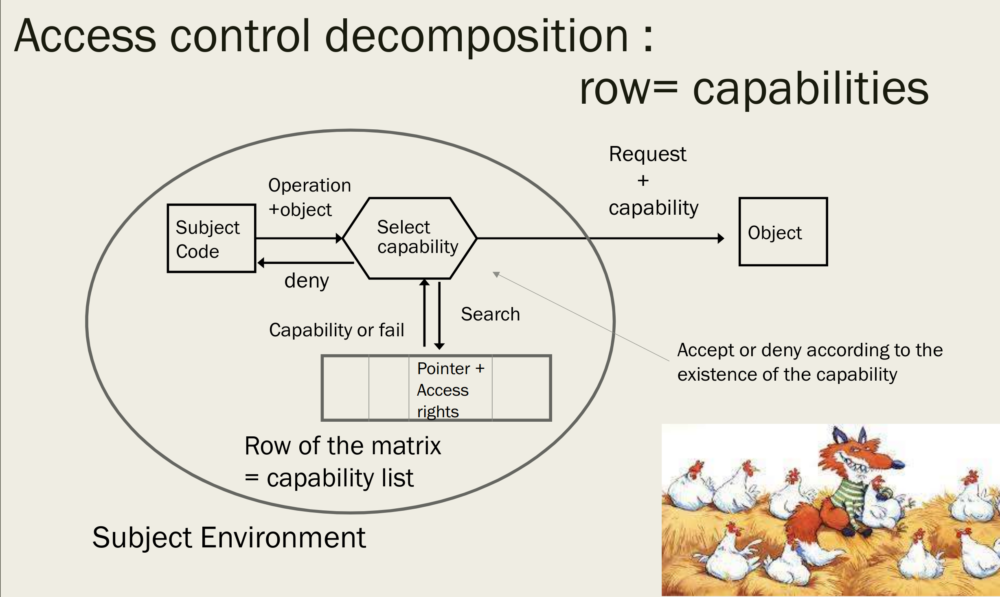

= Security Availability and Privacy of Health Data -  Root of Trust
:toc:
:toc-title: Contents
:nofooter:
:stem: latexmath

== Trusted Platform Modules

TPMs are used to authenticate devices/machines and their configurations

Depending on the device used you can have different rights

* Company device grants certain rights
* Personal device grants fewer rights (probably)
* Unknown device grants even fewer rights (ideally)

When we build a system we assign each component a private key

The key *HAS* to be hardware bound

* software bound keys can be modified
* Earlier TPMs were dedicated chips
* Modern TPMs are a part of a chip
** harder to desolder and replace

We generate a public key certificate to distribute the public key to other devices

TPMs guarantee that a system will behave a certain way

* this behavior may be malicious but at least you know what it is

=== TPM misonceptions

TPMs are entirely passive

TPM doesn't know what is being measured

* host software takes the measurements and sends them to the TPM
* e.g. doesnt know if you have Word 2007 or Word 2013 installed

Doesn't perform disk encryption

=== On Chip Algorithms

Endorsement key is permanent (stays the same even if you sell your computer)

Storage root key is generated and signed using the endorsement key

Endorsement key and storage root key must *NEVER* leave this module

* used to prove that the system was configured in a certain way

RSA key generator generates pairs of keys

* public key is signed by endorsement key

== Platform Configuration Register

Platform configuraiton registers store info about system configuration (signed with endorsement key or storage key)

* Multiple PCRs
** at least 16
*** enables partial configurations
* 20 bytes long
* Information about *software* configuration

At power on/boot:

* initalized to 0
** not ideal
** would be better to initalize based on random values/TPM info or something
* take some information
* hash it
** called *measurement*
* store in register with hash
* if doesn't fit calculate new hash
** `val[pcr] = SHA1(val[pcr] || newval)`
* PCR is extended on every boot
* contains hash chain of booted software

PCRs sign the software that lives on a certain machine and the order in which it appears

=== Trusted BOOT

. Press power button
. Load BIOS
.. extend PCR with BIOS
. Load bootloader
.. extend PCR with bootloader
. Load OS
.. extend PCR with OS

If I use a different BIOS/bootloader/OS/application (or use the same in a different order for some reason) a value in a certain PCR will be different

== Root of Trust

PCRs can be sealed or unsealed

* Given some data:
** encrypt it with TPM key and status of certain PCRs

PCRs have certain values at t_x but those values can change between t_x and t_x+n

If you receive an encrypted blob and you can decrypt it then you are authenticated

If you can't decrypt it anymore then your configuration has changed

Malicious systems can send an old blob for verification to pose as a legitmate configuration

* this is because your PCRs are the same as what the other system expects

=== Memory Curtaining/Confidential Computation

Certain areas of encrypted memory can be accessed only by entities with a certain key

* not even the OS can access it
* e.g. an application that requires total security can encrypt the memory it's using

=== Remote Attestation

Allows changes to the user's computer to be detected by authorized partners

For example:

* banking apps check if OS is running recent security patches
* enterprise network allows laptops to connect only if they have authorized software

== Control and Management of Access Rights

After authentication (person and device) user rights have to be assigned

Often using a *matrix* to represent permissions/rights/privileges:

* Account `peter` can access `/home/*`, can run web browsers and word processing and such but they can't access `/etc/`
* Account `root` can do everything
* Or if user `peter` can access a DB on some server, but the node on which they are authenticated can't, then `peter` can't access the DB
* better to find and stop impossible requests ASAP, ideally before the request is even made
* if we let the request propagate we open the system to a DOS/DDOS
* *fail soon, fail often*

A system has multiple matrices depending on the level of abstraction (OS level, application level, etc.)

=== Abstract View

This is bad if we have multiple users:

* reference monitor becomes bottleneck

We need decompose the matrix (row wise/column wise) into multiple parts to parallelize

==== Row-wise decomposition - capability list

Each row of a matrix is a subject (user, service, app, etc.)

Subject environment:

* memory
* running software
* stuff the subject is using

Add row of matrix to environment

When subject wants to do something they have to:

. point to the object on which they want to work
. describe the operation they want to do
. find the cell that allows this action
. if cell exists:
.. request is made
. if cell doesn't exist:
.. request is not made

This is not ideal because the subject (in theory?) can manipulate the capability list since it's in their environment

* they can give themselves rights they shouldn't have

Plessey PP250 used specialized dedicated hardware to prevent capability list manipulation

* worked because not in a network

We can encrypt the capability list before handing it to the subject and decrypt it when running the final check

* mandatory for networked systems
We can encrypt the capability list before handing it to the subject and decrypt it when running check

===== Distributed implementation

capability = `[protected_fields, check_digits || signature]`

capability is built by:

. applying a keyed hash of the secret
* `check_digits = signature = f(SECRET, protected_fields)`
. when the resource manager receives the request it checks:
[source,python,attributes]
----

f(SECRET, protected_fields) == protected_fields

----

====== Capability and distribution

* Protection - encrypt capabilities
** from tampering
** from stealing if authenticated

* Generation
** only the server/manager can create the capability

* Delegation
** a subject can give a capability to another to use it on a resource
*** e.g. *NIX system process forks

* Revocation - removal of rights
** difficult due to race conditions
*** p1 has cap C but we want it back
*** by the time we make the request p2 now has C

==== Column-wise decomposition - ACL

The object now has data structs and code that checks legality of requests

Access Control Lists stores the matrix as columns -> each column is an object

Object implementation also stores info to control object access

ACLs are more flexible so we can use them to deal with unknown requests

ACLs can be default allow or default deny depending on the *final rule*

* if last rule -> pass = default allow
* if last rule -> deny = default deny

===== Router ACL

Router example:

* routers have in/out lines to route traffic
* if you want to go on node N you have to exit from line L
** uses a table to do this easily
* each message has source and destination addresses+ports

ACL of a line is made of basic rules using IP ranges and route/drop

Rules have to be ordered in a specific way to avoid weirdness (like .gitignore files and such)

Input 1:

. IP Range 1 -> route
.. 131.114.\*.* -> route
.. 131.4.5.6 -> route
. IP Range 2 -> drop
.. 131.4.\*.* -> drop

ACLs are used in the output too

Output 1:

. 131.114.\*.* -> drop (don't let it out of this node)
. 131.4.\*.* -> drop
. * -> route (let everything else through)
.. this is default allow

Rules can be refined using ports, protocols etc.

For instance:

* 131.114.\*.*:9000 TCP -> route
* 131.114.\*.*:9000 UDP -> drop

===== iptables

Routing in Linux uses iptables

There are a few parts:

* Input chain
** rule to handle packets addressed to a given node
* Output chain
** rule to handle packets transmitted by the node
* Foward chain
** rule to handle packets that cross the node
** packets that need to go to a different node but pass through this node

iptables actions:

* Drop
* Route
* Goto/return
** pass this packet to a different chain and give it back when done
* Log
** write message down somewhere
* Reject
** drop but let the sender know
* Dnat
* Snat
* Masquerade

iptables uses default allow for some reason

===== Egress filtering

Don't forget to check *egress traffic*, i.e. traffic that leaves the network/a node

* allows you to know if you're generating bad traffic
* also lets you find out if you're being used for DDOS attacks
* and also lets you block legal users from accessing illegal services

=== Role Based Access Control

Pairs access rights with role within organization

* Oncologist can access info about oncology patients
* Pediatricians can access info about pediatrics patients 
* Nurses can access emergency info about patients
* Admin can access billing info but not therapy/medical data

This requires the data to be classified (i.e. split into classes) and the database(s) used need to reflect this classification

If there are many roles you should make equivalence classes so you don't descend into madness

Roles might also need to be assigned dynamically

* e.g. if oncologist is assigned night guard shift they are assigned night guard role where they can temporarily do things outside their normal role  

==== Role Hierarchy

Hierarchies state that certain roles have more privileges than others

For example:

* primary physician is higher than specialist physician and intake nurse
** means that primary physician can do all the things intake nurse and specialist can do but not the other way round

=== Attribute Based Access Control

Generally used at application level

Access is granted/denied based on certain attributes

* Subject clearance level, role etc.
* Action
** read, delete, view, approve, modify
* Object type
** medical record, bank account, department, geolocation
* Context
** time, timezone, geolocation

Very flexible but if attributes can be manipulated then you might have a problem

== SELinux

Now it's a kernel module, but it used to be a Linux version where users could set *ANY* kind of security policy (MAC/DAC)

The user configures the security policy

SELinux defines:

* Program access rights
** triple (type, role, level)
** typeA can execute typeB
** users of type T with role R can execute E
** level L users can read file F but level L-1 users can't read file F
* Programs the user can run

SELinux rule:

`allow user_t bin_t : file {read execute write getattr setattr}`

Where:

* Source type(s)
* Target type(s)
* Object class(es)
* Permission(s)

The service module/server checks if the user's pointer is good before it allows the user to do something

SELinux as an OS is dead

=== The death of SELinux

SELinux allowed users to set any policy, including the standard Linux policy

To make SELinux behave like standard Linux you'd need:

* 29 types
* 121 operations
* 27,000 rules

The real problem is writing 27,000 rules without some kind of compiler/tool to generate them

No real way of checking the correctness of the policy

Since Linux considers everything as a file, it makes it hard to assign allowed operations and such based on types

== Windows Authentication and Tokens

Windows has a key distribution center (like in Kerberos) that interacts with Active Directory

There's also *NTLM Authentication* where the server interacts directly with the domain controller/active directory using challenge/response mechanisms 

=== Kerberos vs NTLM

Kerberos is the default authentication

NTLM is the backup in case of Kerberos failure

NTLM was affected by several vulnerabilities

* hashing
* salting - NTLM didn't salt passwords stored on the server and domain controller
** attackers could brute force the password database if they really wanted to
* poor encryption and outdated algorithms
* vulnerable to DOS attacks

=== MS Kerberos vs MIT Kerberos

MIT Kerberos uses encryption keys as authorization tokens to interact with a service

MS Kerberos produces a token with information about the user's group membership (user foo is in groups bar and baz)

* user levels are used for integrity
* rights for various groups are applied using ACL

When you log into Windows you authenticate yourself with the Local Security Authority using Kerberos/NTLM 

LSA checks its database and if you're in there you are given a token with a bunch of information and a login session is started

The token determines what you can do on that machine

A session can have multiple tokens, but a token cannot have multiple sessions

Each session has a unique 64bit identifier

==== Tickets vs access tokens

Tokens have information to allow services/servers/whatever to identify, authenticate and authorize the user

They are volatile cache storage of security information which can be used as a proxy for a logon session

Attributes such as:

* User Security Identifier (SID)
* Group membership
* Privileges held
* Original logon session ID

Access tokens can be copied for parallelizing processes or to delegate capabilities

=== Mandatory Integrity Control

Controls access to securable objects

Only subjects/users with integrity level L can interact with resources of level L and below

Windows has multiple levels:

. Installer
. System
.. System services and processes
. High
.. Elevated users and their processes
. Medium
.. Standard users and their processes
.. Default integrity
. Low
. Untrusted

These levels are used to maintain container integrity (Docker A cant mess with Docker B)

==== Access Control

When a subject/user wants to access an object with a security descriptor the kernel checks 3 things:

. Who is requesting
. What do they want to do
. Who is allowed to access the object

2 types of access control lists

* DACLs
** list of allowed/disallowed SIDS for users/groups/objects to interact with
* SACLs
** log of successful/unsuccessful auditing events

Access Control Entries are the entries in either DACL or SACL

* DACL ACE specifies access rights
* SACL ACE logs success/failure of specific actions

=== Sandboxing tokens

Tokens need to be neutered sometimes to avoid funnies

* Firefox delegates its token to a child process that manages a download
* Before saving the file to the filesystem Firefox download manager needs to pass its token to the file system

This is called *Sandboxing*

Breaking down a big process into smaller more manageable subprocesses with fewer capabilities/privileges makes the system more robust 

* following the principle of least privilege is key

=== Remote Host

Since a logon session is machine bound users cant simply transmit a token

They have to reauthenticate at their new location

Authenticating to a third location from the second location is also impossible unless the credentials are cached