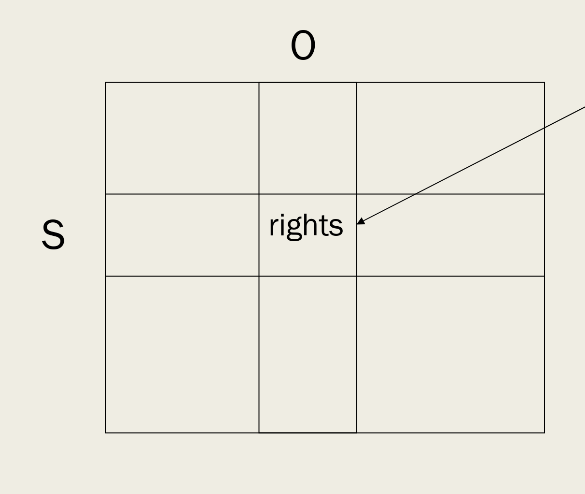
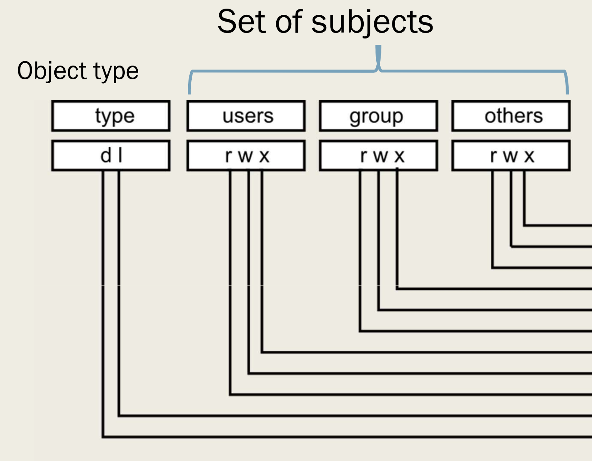
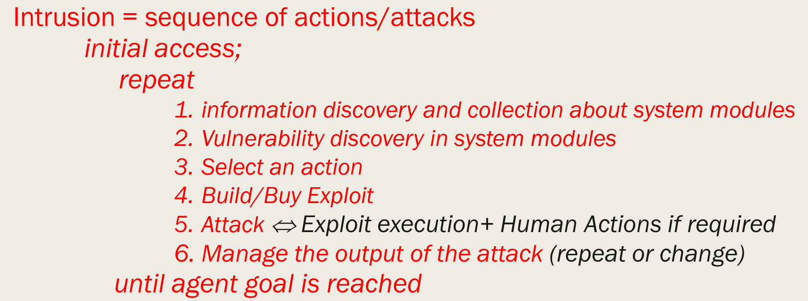

= Security Privacy and Availability of Health Data
:toc:
:toc-title: Contents
:nofooter:

== Information Policy and Access Control

* The implementation of an information policy for all system resources

=== Access control matrix

  

Matrix rows Subject col Object

Pos [i, j] -> which operations subject I can invoke on object J

Matrices are necessary but not sufficient -> there needs to be some representation of some version of this matrix

=== Linux FS Access Control Matrix

  

Set of subjects with object type

3 main components:

. owner of the file
. members of owner group
. others

command `ll` (`ls -l`) shows who can do what to any file in a directory

*The simpler a matrix, the less secure the system is*

* Simple matrix is required for speed
** large file descriptors take more time to load
** splitting users into groups is easier than managing single users
*** less fine grained control can lead to problsm

== Vulnerabilities, attacks, intrusions, threat agents

=== Vulnerabilities

Reasons why security policy cannot be/is not being enforced

* Vulnerabilities are software errors (sometimes hardware) that can allow a threat agent to execute an attack
** granting the threat agent access rights they shouldn't have -> security policy is violated

vulnerabilities == bugs != vulnerabilities

There are ~40 flaws per MB of code

* Cyclomatic number
* The number of cycles in a graph representation of a program -> the messier the code -> the higher the chance of a vulnerability

=== Attack

* Human and machine actions required
** e.g. asking someone for their password by pretending to be someone else -> social engineering
** e.g. running code to obtain access rights they shouldnt't have
* we can ignore a given vulnerability until we know that it can be exploited
* the outcome of an attack is stochastic -> it can fail according to some probability distribution
** many variables that affect the outcome (timing, lack of resources, random events)
*** don't trust exact risk percentages
** very few attacks are deterministic
* Some attacks require specific tools
** specialized scanners, card skimmers
* social engineering attacks manipulate people
** convince someone to do something (e.g. click this link for free photoshop)
** they can be mass attacks (send phishing email to everyone and see who takes the bait)
** they can also be targeted (send phishing email to specific target - spearphishing)
* reverse engineering attacks deduce some information/data about a module from its executor (program)
** decompilers are useful to get the source code of an executable file

Exploitability -> the odds of a successful attack using a given vulnerability

Severity -> how much damage an attack can cause (i.e. how many rights an attacker gains)

Worry about exploitability >= medium and severity >= medium

=== Threat agent (adversary)

* Threat agents are sources of attacks

* Threat agents may be:
** natural (disasters)
** man made (malicious adversary with a goal)
*** it can also be random, e.g. user clicking phishing link
** malicious threat agents usually implement an intrusion -> sequence of actions and goal directed attacks
* it's rare that attackers succeed using a single attack attempt/a single vulnerability
** indication that the system is insecure
** secure systems usually require multiple attacks
* we can only assess risks if we know:
. assetts
. vulnerabilities
. potential threat agents

=== Intrusions

* Sequence of actions and goal directed attacks by a threat agent to illegally control parts of an IT system
** at first the attacker only ownts its legal access rights (attack surface)
** some actions are attacks
** some actions collect information to discover new attack surfaces
** both actions and attacks can be implemented by a program

* each attack in the sequence is enabled by:
. vulnerabilities
. system users

* those in control of an IT system/subsystem can:
** collect/exfiltrate information
** update information
** delete information

Attackers have to:

. learn what vulnerabilities are in the system before they can attack (*Collect*)
. figure out how to exploit these vulnerabilities
. exploit them (*Exploit*)

Automated attack platforms are hypothetically possible

* Intrusions typically last days (31%)
* If intrusions last weeks or months -> the attacker is deliberately taking their time to stay hidden (24%, 22%)
* Mean time is generally around 100 days (between initial access and the defender waking up)
* Fast detection times (e.g. hours) are usually caused by ransomware attacks -> the attacker wants to be found

==== Initial access

* How the attackers get their foot in the door
** compromising tech assets
** stealing a password
** supply chain attacks
*** attacking an involved third party (e.g. physical device vendor, software vendor, maintenance staff, basically anyone)
* some attackers gain initial access and sell it to other attackers on the dark web

* with each step the attacker gains more information which they can then use to gain more rights
* this loop is called the *privilege escalation* loop
* some attacks are useless
** they grant the attacker rights that they don't need to reach their goal

* attackers can install tools to remain in the system (*persistence*)
** make a fake account
** inject code in the system bootloader

* when done attackers erase all traces of intrusion
** the more things an attack changes -> the easier it is to find
*** e.g. network load, new files, new accounts that no one knows who made

* if by discovering+exploiting vulnerabilities the attacker can control a resource -> resource is exposed

==== Defender vs attacker

* Defenders think in terms of
** vulnerabilities
** attacks
* defenders should also think in terms of paths
** how many paths are there?
** how can these paths be blocked?

* Attackers focus on:
** intrusions
*** how to acquire the rights I need
** paths through a system
*** rights+info required to move to the next node
** sequences of attacks
*** how to sequence these attacks

==== How many paths/exposures?

50% of firms have up to 11k exposures, 5% have over 255k exposures

If 1 exposure = 1 path -> many many potential attack avenues

Attackers gain initial access in a variety of ways:

* Exploiting a vulnerability
* Social engineering (e.g. malicious email)
* Brute force (i.e. guessing passwords/usernames)
** requires resources
*** resources can be easily acquired (e.g. Amazon S3 VMs)
* Removable media (e.g. infected USB drive left for someone to find)
* Inside man at the firm
* Leaked credentials (e.g. bought from a data breach, packet sniffers, etc.)
* Misconfiguration vulnerability exploitation (e.g. storing unhashed passwords on login server)