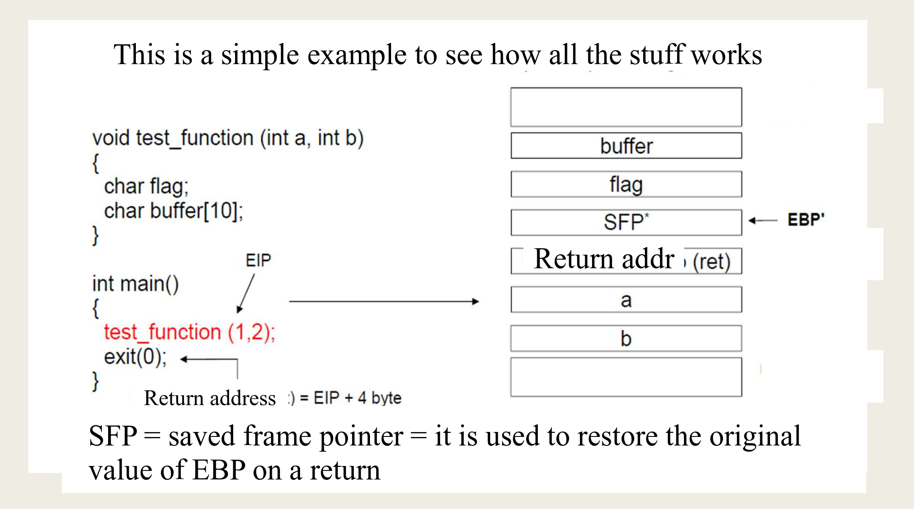

= Privacy security and availability of health data
:toc:
:toc-title: Contents
:nofooter:

== Countermeasures

If there is an intrusion -> need to break the attack chain

i.e. fixing one vulnerability can close an entire path or more if they use the same vulnerability

=== Static countermeasures

Static countermeasures are final (e.g. bug fix)

=== Dynamic countermeasures

Dynamic countermeasures are temporary (e.g. closing a specific connection to stop an attack)

You need a monitoring module to enact dynamic countermeasures -> you have to know you're being attacked

Dynamic countermeasures should be automated

== Our perspective

* Focus on adversary operations
** what they can do to the system
** what kinds of intrusions they can create
*** the odds of a successful intrusion
** what resources are at risk
** potential attack strategies

=== Alternative approaches

==== Unconditional security

Any vulnerabilty in the system will be exploited by an attacker regardless of cost and complexity

Used mainly in defending extremely valuable resources -> state security

Very expensive

==== Conditional security (risk management)

Find out:

* what needs protection
* who wants to attack our system (e.g. nation state, hacker gangs, disgruntled customers)
** which vulnerabilities their intrusions can exploit
** what attacks they can implement
** how they behave in an intrusion
** how to stop these intrusions 

Most common in the civilian world

Less expensive

=== Risk assessment and management

There are many definitions

Risk is the mean loss for intrusions in a time interval

Depends on:

* odds of a successful attack
* how much/what we lose due to a successful attack

Expressable as a product of odds*value (higher odds = more risk, higher value = more risk)

. Asset analysis
* What resources are in the systems and which need protection
. Threat agent analysis
* who is attacking and who is defending (specifically intelligent adversaries)
. Vulnerability analysis
* System flaws and associated attack surfaces
. Adversary emulation
* simulating intrusions to see what attackers can reach
. Impact analysis
* Damage caused by a given intrusion
* What happens if a path is taken by an attacker
. Risk evaluation and management (compute and minimize loss)
.. Compute the risk (odds*value)
.. Accept the risk -> it is what it is, don't care about loss
... If cost of countermeasures > loss -> accept the risk
.. Reduce the risk -> close intrusions by eliminating vulnerabilities
... Pick and choose what to deal with and when (countermeasures + scheduling)
.. Transfer residual risk
... Buy some insurance for known certain loss
. You can accept some risks, reduce some other risks and insure the rest

== Vulnerabilities

2 classes of vulnerabilities:

=== Local vulnerabilities

Vulnerabilities in a particular module (software, hardware, humans)

Using other modules can be required to exploit this vulnerability but we can cut it off at the source

==== Memory overflow

* Often present in programming languages without strong data types (especially C with pointer arithmetic)
** e.g. making an array of length 100 and shoving 200 values in it
** the extra 100 values will occupy memory that isn't theirs
** these extra 100 values can store/represent executable code/shell commands
*** confusing data and instructions -> von Neumann ambiguity
* Memory overflows can exploit any of:
** stack
*** when we run a method/function/procedure we use the stack
*** this is written to a record that stores:
**** activation parameter
**** return address 
*** the stack writes down (towards higher addresses)
*** if you copy -> write up -> data is destroyed
** heap
*** area used to store malloc calls and such
*** grows down (towards higher addresses)
** bss

Stack and system registers store pointers to activation records

Who is the culprit?

. Programmer
.. they didnt use builtin memory management functionalities
. Bad type system
.. person who picked the wrong language for this application
. Incorrect memory operation
. Growth direction of the stack
.. If the stack grew upwards we wouldn't have this problem

==== Buffer overflow

Attackers want to inject code that grants root privileges in the stack

They write a string with code -> the pointer to the normal return address now points to the malicious code

Code executed by the OS is executed as root

Popular among worm malware, peaked in popularity around the 90s

Easily reproducible once the procedure+string are known

Attackers have to know:

* where their string will be written
** they need this to know which address to overwrite
* what string to write

==== Stack vs heap

Attackers used to attack the stack much more than the heap

Recently heap overflow attacks have become more common

==== Local vulnerability countermeasures

. Strong typing (unless the module is large and already built)
. Programming discipline
.. programmers should check size of variables
. Stack canary
.. useless constant stack parameter that goes BEFORE the return address
.. overflows will overwrite the canary before the return address
.. if canary is the same -> no overflow, if different -> overflow
. DEP (data execution prevention)
.. memory pages have bits that determine what you can do with that page
.. you can read and write to the stack
.. overflows are execute op
.. grant rights to read and write but not execute -> page bits prevent execution
. shadow stack
.. store return addresses on it
.. cant modify shadow stack
. ad hoc compiler checks
.. e.g. checking strcpy() for weird behavior
. ASLR (Address Space Layout Randomization)
.. return address is picked randomly
.. modern systems have 64 bits that I can use to store the address
... e.g. I can store it at [0, 4] or [48, 52] etc.

===== Local vulnerability countermeasure costs

Each countermeasure has a specific cost: 

* Strong typing = 10-30% run time overhead (program runs 10-30% slower)
* String length check = expensive but cheaper than strong typing
** Array bounds checking as well
* Canary = cheap (built into GCC?)
* ASLR+MMU translation = cheap
** 99% of the time this is done automatically
* Non executable stack = cheapest
** requires hardware+firmware support
** not always possible
*** some OSes (Linux) use system stack to load device drivers when interruptions arise
** needs shadow stack for best results

=== Structural vulnerabilities

Vulnerabilities that emerge from the interaction of multiple (otherwise good) modules

Much harder to discover and deal with

==== TCP/IP

When TCP/IP stack was defined the primary concern was resilience against physical attacks (i.e. nuclear bombs)

Main goal = availability

Mechanisms introduced to discover which nodes are alive and reachable

* Nodes send an ECHO message to a node to check if they are alive/reachable
* Receiver replies with the same message
* Senders can specify a partial IP address to check multiple nodes at once
** i.e. if node uses 16 bits of IP address instead of 32
* No control on the IP packet fields
** Messages are not authenticated

No mechanisms to authenticate the source of a message

* logical attacks were not considered

===== Example

* R -> network of 1024 nodes
* X -> partial IP address matching the addresses of all nodes of R
* Node A sends an ECHO to X but uses Node B's address as the sender address (A pretends it's B)
* Any node in R replies to B
* B cannot interact with other nodes because its communication lines are flooded with ECHOes

This is a *Distributed Denial Of Service* attack

No loss of information

No permanent damage

Only waste of time and resources for the duration of the attack

It could be used to DDOS an authentication server but not common

===== DDOS countermeasures

If you have a local vulnerability you can expect to be attacked

You can't expect a DDOS -> it's hard to be prepared

* Sender authenticateion
** Switching to IPv6 forces node authentication but won't happen
* Avoid ECHOes with partial addresses
* ECHO quota
** you can send/receive 50 ECHOes per second or whatever
* CDN
** distributed copies of your content that continue to work despite DDOS attacks on another node

==== Other structural countermeasures

Add new modules

Firewall

Wrap module

* Expose only certain functionalities

Endpoint protection

Intrusion detection

Antivirus software

== Attack infrastructure/Command & Control/C2

Serious attackers don't attack from their own systems

Usually they build botnets that are then used as attack platforms

* Botnets are overlay networks that include resources from other systems that the attacker has previously attacked
* Attacks to create botnets are stealthy and much slower
* There are attackers that build botnets and sell them to other attackers on the dark web

To defeat an attacker we can destroy their botnet

* *offensive security* or *defense forward*

Botnets are very large (tens of 1000s of nodes)

They often exploit IOT devices (smart thermostats, smart switches, IP cameras)

Botnets use legitimate devices

* We can't simply turn them off
** e.g. botnet node running off a CT scan machine or a heart monitor

== Partial views on security

Security != confidentiality (alone) <=> encryption

Encryption methods don't guarantee availability (you can still get DDOSed)

Encryption simplifies 

* instead of protecting 10TB of data you protect 10kb of encrypted data
* you still have to protect the data

Symmetric encryption -> 1 key to decrypt and encrypt

Asymmetric encryption -> 1 key to decrypt and 1 key to encrypt

* encryption key is generally public to allow sending secure and authenticated data

Encryption alone is useless if the OS doesn't provide some security guarantees

=== Authentication

Authentication alone isnt enough

Auth methods:

* Something you know
** password, PIN, security question
** weakest
* Something you own
** phone, card, UBIKey
* Something you are
** fingerprints
** voice
** retina/iris

MFA methods ensure strong authentication

Biometric features cannot be changed

Biometric systems use a digital representation of a feature

* Attackers could steal that digital representation and attack the system with it