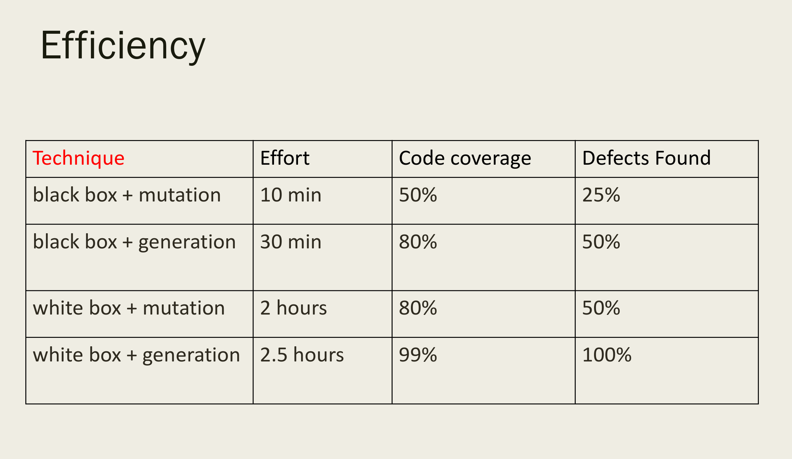
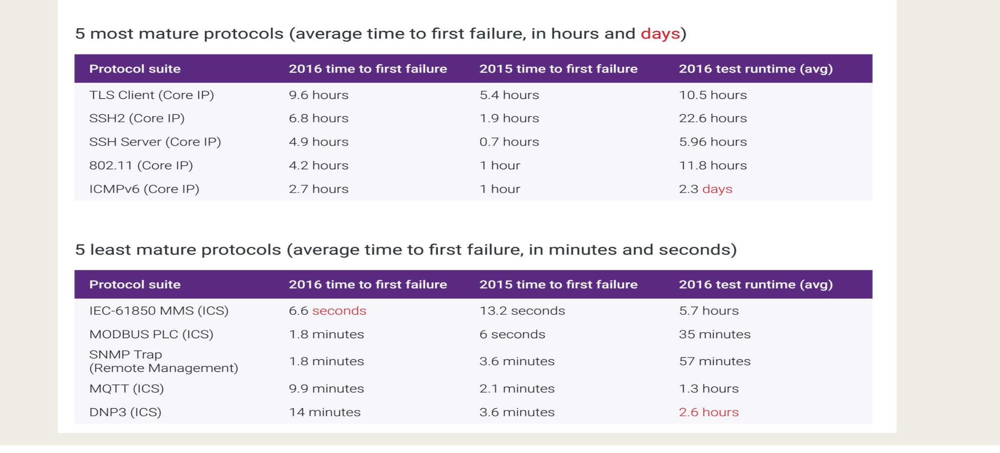
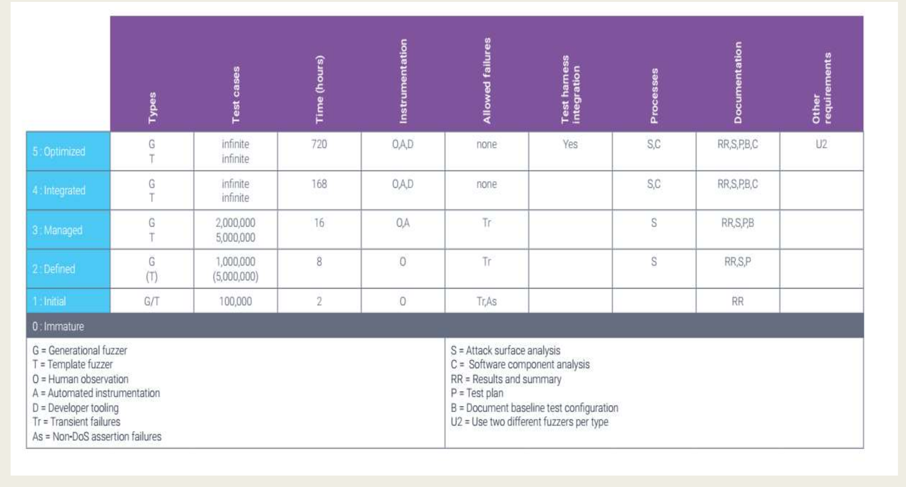

= Privacy Security and Availability of Health Data
:toc:
:toc-title: Contents
:nofooter:

== Vulnerability discovery

=== Discovering vulnerabilities in a module

Finding bugs in code that can potentially be vulnerabilities

=== Human analysis

If you don't have the source code

Reverse engineering an executable

Used to produce a high level algorithm

=== Automated analysis

2 ways to do it:

==== Static analysis tools 

Static Application Security Testing tools that vary based on:

* the programming language used
* system/web programming (?)
* looks for dangerous patterns
** accessing a[i] without checking if i is valid
* very expensive (10s of thousands/100s of thousands of dolans)

// make table

Pros: 

* scalability
** can analyze a lot of code
* outputs very useful information
** can give single incorrect instructions (you didnt check bounds at address whatever)
** this simplifies debugging

Cons:

* some things it can't deal with
** authentication issues
** dangerous access rights management
** unsafe cryptography uses
* it can't understand program control flow
* can't analyze libraries (lmao)
* many false positives when dealing with important variable values

==== SAST techniques

Pattern based analysis

Metric based analysis

// add later its all in the slides

==== Dynamic analysis tools

If you have the source code and/or an executable:

* feed the code inputs and see what happens
** feed it wrong/unexpected inputs and see how the system deals with them
** *fuzzing*

== Fuzzing

Fuzzing tools have 2 parts:

. A generator that generates malformed data
. An input scheduler that feeds the malformed data to the module

If the module crashes it logs the input that caused the crash and where it crashed

* it means there is a bug in the module that could be a vulnerability

Extremely powerful technique (especially since it's automated)

Various types of fuzzing:

* Application fuzzing
** testing input fields and buttons in GUIs
* Protocol fuzzing
** analyzes module behavior when it receives mangled inputs
** checks if mangled inputs are executed as commands (which would be bad)
* File format fuzzing
** generates mangled files
** generating file formats with detailed specifications is hard

Fuzzing finds many bugs:

* Memory leaks
* Injections

// see slides

Fuzzers cant just generate random bits of input

They have to check all possible instructions

=== Fuzzing rules of thumb

. Knowledge of the input is important
* easier to generate inputs
* especially important for blackbox fuzzing
. Generational > random/mutation (usually)
. Better specs make better fuzzers
. Use different fuzzers on the same code
* fuzzer implementations vary
* one may find bugs another can't
. Run longer -> more bugs
* flattens out after a while
* diminishing returns
. Guiding the process leads to best results
* e.g. you know how many instructions are touched by a certain input
. Use profiling when stuck

=== Fuzzing/fuzzer classes

==== Generation based fuzzing

Generating inputs based on rules (i.e. what the program expects)

* e.g. input should be max 128 char
* fuzzer makes 129 char input

Protocols can be *grammar based* or not

If grammar based we can use them to generate legal inputs which we can use to make illegal inputs

==== Mutation based fuzzing

Takes known correct inputs and modifies them randomly

==== White box fuzzing

If we have the source code we can use it to trace where the input is read/executed/whatever

==== Black box fuzzing

We only have an executable

Hard to think about higher level code

We can only deal with the executable code (or reverse engineering)

Important for ICS modules and IoT devices

* IoT devices and ICS module source code is rarely available
* Static analysis is impossible

Use a VM that performs stack traces to understand what happens where and when

* VMs can tell the host various things
* even better if using debugger as well

==== Greybox fuzzing

We have part of the source code or a partial executable

=== Tainting analysis

Preliminary static analysis of module source code

Given an input -> what instructions take the input

* How the input propagates through the program

It returns a set that includes variables of interest (leads to some false positives)

=== Evolutionary/feedback based fuzzing

Given the output of a certain input we learn what inputs to generate better fuzzed inputs

* Autodafe

=== Fuzzing efficiency

Executable only:

* few known valid inputs to fiddle with -> we call 50% of the instructions in 10 mins (bad)
* able to generate inputs -> call 80% of the instructions in 30 mins

With source code:

* few known valid inputs to fiddle with -> 80% in 2 hrs
* able to generate inputs -> 99% in 2.5 hrs (100% of defects founds [terms and conditions apply])

Times are measured with commercial hardware (no fancy supercomputer memes)

=== Fuzzing results

Time to First Failure -> how long it takes to cause a crash when fuzzing

Fuzzing analysis of some protocols (not implementation, the protocol itself)

* chaos monkey replies with garbage

most of the least mature protocols are ICS -> industrial control system protocols

* bad news for factories

test runtime -> time taken to cover all code instructions

=== Fuzzing maturity model

This is for whitebox+generation testing

* for certifying software

=== Why does fuzzing work so inexplicably well?

* Moore's law
* hardware power increases -> takes less time to do bad things
* Embarrassing parallel
** n cores and n inputs -> create n copies of the program -> n fuzzing processes at a time
** i.e. parallelizes insanely well
* Fuzzing complexity changes linearly with code size
** other analyses could grow exponentially etc
* Fuzzing works at assembly level
** other analysis tools work on higher level languages
** they are much more complex
* No false positives
** if program crashed there must be a bug
* AFL (fuzzer) abuses these advantages
* Reasonably simple to implement

=== AFL

Represents code as basic blocks

Each basic block has a counter

* hashmaps the counter to a hashtable cell
** run the risk of hash collisions
* counts how many times it stepped through that arc

== Web vulnerability scanners

Not actually scanners 

Used to analyze dynamic websites

They scrape dynamic webpage source code

They dynamically test the scraped pages

Can be run even in authenticated sessions with predefined passwords and/or cookies

More similar to a breach and attack simulation

Important to discover attack surfaces

=== What they can discover

==== SQL Injections

Writing SQL expressions into input boxes that are used to search databases (like Amazon)

* use SQL code to insert/read info into/from a database
** read info that it's not normally meant to access
* PHP and such have builtin functions to check for injection attacks

==== XSS

Cross site scripting

* User generates input that is written to the website and others can download/save to their machine
** When users write a blog it's saved to a database
** Users can comment on blog entries for example
** Other users can read the blog and the comments
** Users can write code into comment boxes (even by just including an animated emoji)
** Malicious users can write malware into comments that is executed by the browser 

Stored XSS: malicious script is stored on target website

* script is executed when browser loads the page

Reflected XSS: malicious script is reflected off a website and is executed when the user clicks a link

DOM based XSS: 

==== CSRF

Cross site request forging

* When a user is in an active session (e.g. logged into bank website)
** e.g. opening malware website while authenticated
** can steal login session and steal money from account

==== Watering hole attacks

Poison the watering hole -> put malware on very popular websites

=== What they can't discover

SEO poisoning 

* Cloning a popular webpage
* Typosquatting

== Image scanning for vulnerabilities

Image as in Docker/Kubernetes NOT images as in photos

These tools run fingerprinting on images to find vulnerabilities

Should be used while creating and before adding them to trusted image DBs

You can statically analyze images:

* Indexing: find the modules used to create an image
* Matching: matching the indexing report against a vulnerability database