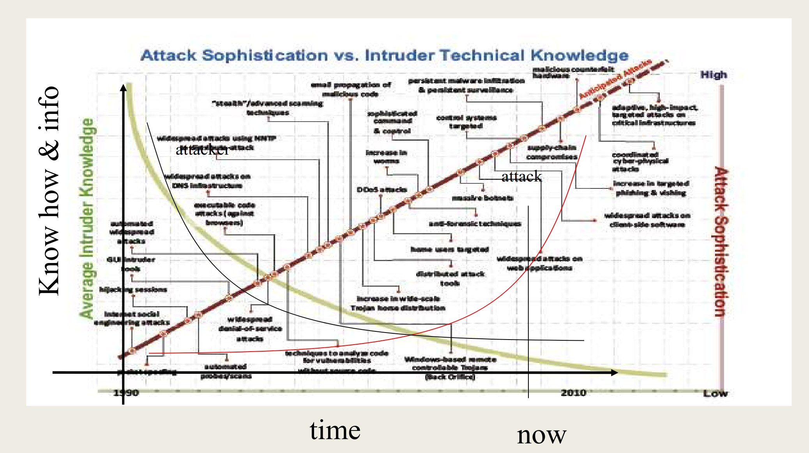
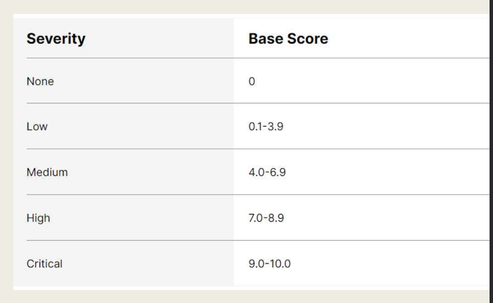
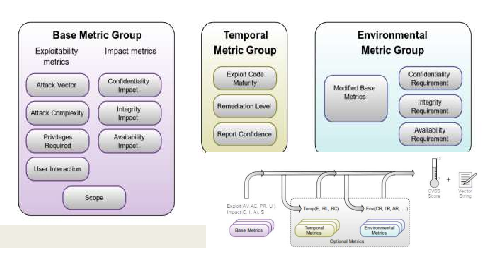

= Security Privacy and Availability of Health Data - Cyber Attacks and Possible Remediations
:toc:
:toc-title: Contents
:nofooter:

== Attack analysis

Before thinking about resolving attacks, we need to know what attacks can be carried out and how

Removing a vulnerability depends on the intrusions it enables

* removing unexploitable vulnerabilities is unnecessary

Changing system during development is much cheaper than changing it while in use

* the earlier the better

=== Attack attributes

Attacks are described by a set of attributes:

. Precondition: you have to be able to call a function/invoke a procedure else cant do shit
* These rights can be obtained legally or illegally
. Postcondition: rights granted after the attack
. Probability
* Deterministic: always happens
* Stochastic: can happen
** i.e. exploiting a race condition, guessing random memory index for stack overflow
** Don't believe exact risk probability (e.g. this attack has a 25% chance of succeeding)
. Prerequisites
* Prior knowledge
** e.g. knowledge of a particular vulnerability or system
* tools
** e.g. powerful computer for bruteforce
. Noise
* Attacks require the system to do stuff (e.g. send a packet, run an executable, authenticate login attempts)
* Defenders with good monitoring systems can find these things out
. Automation
* Automatic: attack is carried out by a tool
** Most dangerous because anyone can do them
* Potentially automatable: 
** e.g. discovering a string that causes a stack overflow
. Local/remote
* Local: attack can only happen on the system where the vulnerability is located
** e.g. stack overflow
** by someone that owns an account on a node/subnet
*** if someone on another node can do it the attack is *wormable*
* Remote: attack can happen on a different node
** e.g. sending a packet to a webserver that causes a stack overflow

The most dangerous attacks are *remote automated* attacks

Vulnerability risk values are not representative of actual risk

* If attackers cant satisfy the preconditions they cant exploit it and thus cant perform attack

=== Attack Chain

A sequence of attacks that leads to satisfying the precondition to run the next attack

. First attack gives certain rights
. Second attack gives more rights

and so on

this is *privilege escalation*

//funny math in slides

*Remember*

Information gathering + information usage

More successful attacks -> more information -> more attacks

=== Automated attacks

I can write a piece of code that runs the attack for me

If I release this code the probability of someone using it increases

Exploit databases have code samples that exploit a certain vulnerability

* Public or private

An intrusion is automatable if all the attacks in the chain are automatable

* usually the most complex to automate

You write the code/find it somewhere and sequence the attacks

Upload it to an attack platform

Platform does the funny

Automated attacks are hell to deal with:

* Executed in electronic time
* Don't require skills/know-how

Attacker skill decreases (yellow line)

Danger increases (red line)

Due to automated attacks

=== Attack taxonomy

* Buffer/heap overflow
** Overwriting memory
* Sniffing
** Grabbing stuff from the network
* Replay
** Copying legal actions
* Interface attack
** Assuming incorrect order of functions (e.g authenticate -> access becomes access -> authenticate)
* Man in the middle
** Manipulation of data/information between A and C
** B manipulates information between A and C
** Works even when encryption
* Time to use/time to check
** checking something while (in parallel) doing something else
*** like checking whats at arr[i] while checking if i is legal
* Masquerading
** IP spoofing
** User spoofing
** DNS poisoning
** Cache poisoning

== Cryptography taxonomy

Cryptography is so important that there's a whole taxonomy

* brute force
* known plaintext attack
** you have n encrypted texts
** one of these is plain (unencrypted)
** use that to figure out how the key
*** Turing/Enigma, Carlo Magno in 1800s
* Differentyal crypto analysis
** git diff on plain/encrypted
* Chosen [whatever]
** forcing someone to send a specific item
* Power analysis
** measuring how much power was used to encrypt some information

=== Side channel attacks

Attacks that measure some physical value rather than exploiting some vulnerability in the encryption algorithm

EMF

Energy consumption

Execution time to discover inner status

Execution time to discover cache usage and prediction
mechanisms

== Attacks and Onions

All cyber systems are onions of virtual machines

Each VM:

* Defines a set of mechanisms
** a programming language

These mechanisms are built on top of/encapsulate instructions from the underlying virtual machines

I don't care what microcode my PC uses as long as I can write code that does what I want

=== Why is this challenging?

You can't abstract vulnerabilities

If one layer has a vulnerability it can be used to attack that layer and those above it

* comparing string function is buggy (hardware error)
* layer 18 uses that function to authenticate
* authentication fails

An OS vulnerability allows attacks on anything that runs on top of the OS

Also allows VM escape attacks

Attackers are now attacking VMs that are lower and lower in the hierarchy

Hardware/kernel vulnerabilities are the most sought after

=== Blue pill attack

Inserts a new VM between VMi and VMi+1

All info going from VMi to VMi+1 can be manipulated by VMbluePill

Generally used to lie about the status of underlying machines

*Stuxnet* used this technique

== Vulnerability remediation

2 ways of dealing with them

. Directly modifying the system
. Adding new components

=== Patching

One of the most popular countermeasures

Assumes we have an inventory

Commercial software patches are often executables that modify the installed program

Open source software is patched by releasing a new version

At the end of the day we have a new executable

Since patches change the behavior of a system/tool we need to check that the new patch doesn't break some other part of our system

* Run tests outside production environments
* Critical for industrial/energy/healthcare applications
** Often takes a few days time
* *Regression tests* are required

We have to decide whether a particular patched/soon-to-be patched functionality is a feature or a bug

* Someone/some other program/module/tool might be using that functionality legally
* If/when it's patched it'll cause problems

There are 2 problems:

. Functional constraints
* By fixing/patching components we reduce the functionality of the program
** e.g. you can pass around strings of any length BUT that can cause a stack overflow - to avoid stack overflows we set a max length -> can no longer pass around strings of arbitrary length
** if someone used these functionalities legally they will no longer be able to - have to consider it
. Resource constraints
* patching requires manpower, compute power, time, money etc.
* patches can also cause more resource consumption

Patching everything is impossible

* expensive
* time consuming
* new vulnerabilities are found every day

Patch scheduling:

* what has to be fixed?
** which of these has to be fixed first?
* when can we develop/test/apply these patches?
* you don't have to patch the most dangerous KEV if your system prevents attackers from satisfying attack preconditions

==== The Essential Eight

Australia/New Zealand made list of 8 things for security/resilience

. patch applications
. patch operating systems
. multi-factor authentication
. restrict administrative privileges
. application control
. restrict Microsoft Office macros
. user application hardening
. regular backups

=== Common Vulnerability Scoring System

Assigning numerical values to certain attributes of a vulnerability

* Base
** Intrinsic characteristics (time/context independent)
* Temporal
** Characteristics that are time dependent (context independent)
* Environmental
** Characteristics relevant to a particular environment (context dependent)
** CVSS doesn't score this

Doing some calculation

Returning a score from 0 to 10

Assign a label to score bins

We can set a threshold for CVSS scores to decide what to patch and when

CVSS formula is somewhat arbitrary and there is no transparency as to how the formula was built

CVSS is an indication of the technical severity of a vulnerability but *not* of the danger a vulnerability poses to a system (not risk assessment) and how quickly they should respond

The basic idea is to set a threshold and patching everything above that threshold

CAUTION: beware of context

There is no guarantee that a high score vulnerability is useful to an attack chain in the target system

*Cybersecurity is intrusion dependent and NOT attack dependent*

==== Access vector

How does an attacker access the system?

* Physical
** stick USB drive into target system
* Local
** have an account on target system
* Adjacent
** need access to subnet of target system
** e.g. have an account on another system on same subnet
* Network
** access from anywhere

==== Attack complexity

How hard is it to execute an attack? i.e. probability of success

* High
** Attack needs preconditions
*** exploting race condition
*** overcoming attack mitigation techniques
* Low
** Attack can happen whenever

==== Privileges required

Privileges required to execute the attack

* None
** Very dangerous
** No PE required
* Low
** Requires some PE
** Grants minimal privileges
* High
** Requires a lot of PE
** Grants many/all privileges

==== User interaction

Is user interaction required?

* None
** No interaction required
* Required
** Clicking phishing link
** Running executable
** Other user memes

==== Scope

Does the attack enable the attacker to reach resources belonging to another entity?

e.g. attacking the oncology department grants access to the cardiology department

* Unchanged (less dangerous)
** Only local resources are affected
* Changed (more dangerous)
** Other resources are affected

==== Temporal score

Exploit code maturity:

. Not defined
. Unproven existance
. Proof of concept
* Works in limited capacity in test environment
. Functional exploit exists
* Works in real world
. High maturity

Remediation Level:

* Official fix
** Full patch 
* Temporary fix
** Band aid fix while official fix is being developed 
* Workaround
** Bodged temporary fix
* Unavailable
** unluko u die now

Report confidence (is the vulnerability actually real?):

* Undefined
* Unknown
* Reasonable
* Confirmed

==== Environmental score

===== Impact metrics

Confidentiality metrics

Integrity impact

Availability impact

All have same scores

* Undefined
* None
* Low
* High

these are context dependent (e.g. nuclear power plant doesn't care if someone knows the max reactor temperature)

=== IT/OT vulnerabilities - Dragos

Dragos provides corrected CVSS scores based on how attackers could exploit a vulnerability (especially in ICS)

Dragos scores are a better indication of risk (terms and conditions apply)

=== Exploit Prediction Scoring System (EPSS)

Probability that a vulnerability be exploited

* specifically probability of a vulnerability being exploited within the next 30 days
