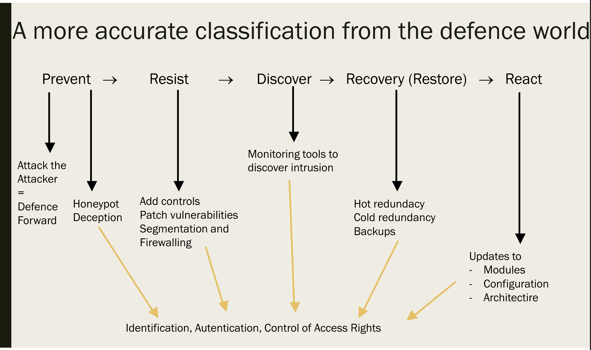
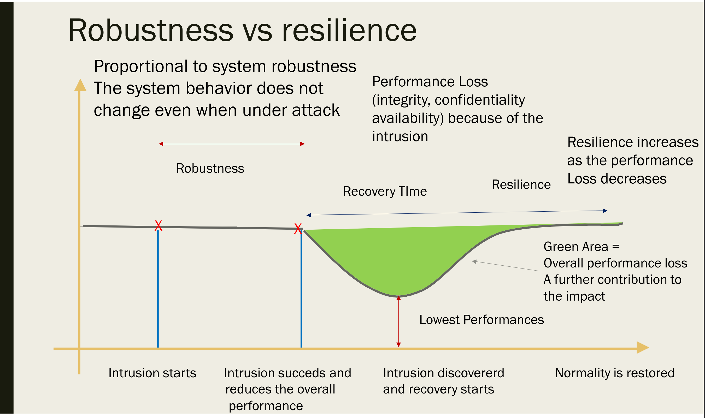

= Privacy Security and Availability of Health Data - Countermeasures
:toc:
:toc-title: Contents
:nofooter:
:stem: latexmath

== Types of countermeasures

There are various types of countermeasures

=== Proactive

They are employed prior to attacks 

* Patching before exploit
* Often permanent

=== Dynamic

Employed during attack 

* Turn off node under attack
* Most often temporary
* Require monitoring to detect attacks

=== Reactive

Employed after an intrusion to prevent further intrusions

* Patching after successful exploit
* Require monitoring to detect attacks

More accurate classifications exist

== 3rs

=== Reliability

Ability to work as expected in normal circumstances or during expected nefarious events

=== Robustness

Ability to work reliabliy during unforeseen circumstances, i.e. strength and effectiveness in adverse conditions

Build robustness into systems to avoid relying on resilience

Proactive rather than reactive

Overly relying on checks is bad because it can reduce performance and increase cost

* have ideal performance
* check how different real world performance is from ideal
** can also be used for monitoring

Having backups and containerization is good

=== Resilience

Ability to return to normal after an attack/interruption

Based on system reconfiguration

Requires redundancy and monitoring

Reactive rather than proactive

Can't cover all edge cases so building resilience also important

=== Business continuity

Continue operating despite non-malicious attacker intervention (i.e. natural disasters, power outages etc.)

Build into redundancy 

* build service in location A
* backup in location B
* very low odds of A and B going offline at the same time
* can also build decentralized *CDN*
** improves responsiveness as well

=== Redundancy

A few ways of building redundancy

* Oversize the system so you can lose some resources and be fine
* Cold redundancy: spare/idle instances of modules that are started *ONLY* when the main instance are unavailable
* Hot redundancy: multiple active instances for load balancing
* Modular redundancy: multiple separate instances that run the same computation on the same input and vote on the result
** MR increases safety but not necessarily increase security
* Use modules from separate vendors to avoid catastrophic single point of failure memes (if one has a vulnerability then all have that same vulnerability) *heterogeneity*
** use different OSes in a network
** use MR
** using different configurations can be enough according to some

==== Centralized/decentralized MR

Choke point for safety/security

If there is a problem with the voting system then we are boned

* seems unlikely

*Byzantine problem*

Malicious attack that says that one submodule has a certain majority while another says it has a different majority

=== Minimal system - depth defense

Highly robust subset of the main system used to recover from disaster/intrusions

*KEEP IT SAFE AT ALL COSTS*

e.g. ATMs

* ATMs are bank account database interfaces
* Losing one or more ATMs has a predictable loss
** each ATM has some amount of money
* Minimal system is the bank account database
** if we lose that database we can no longer control any ATMs

== Authentication

IT systems operate with triple `subject, object, operation`

* user `foo` can access object `bar` and perform operation `baz` on it

2 kinds of checks on triple:

* subject identity control -> who are you?
* access rights ownership -> subject is allowed to do `operation` on `object`

Historically OSes were responsible for this

* nowadays there are specialized tools for authentication
* OS level checks are less complex for efficiency reasons

=== Authentication Classes

Generally have 3 types:

. Something you know
* passwords, PINs, security questions
** weak against social engineering
* Hashed+salted for storage
. Something you have
* YubiKey, phone, smart card
** something that produces an OTP
. Something you are
* fingerprint, face, hand shape, retina
* very hard to change password
** e.g. if fingerprint is dirty you can't get in

==== Weak static

Secret defined string of characters (i.e. a password)

dict of `{username: password}`

if user `foo` gives password `bar` then that user is authenticated as `foo`

However if `baz` gives password `bar` then they are also authenticated as `foo`

Passwords that can be sniffed in transit

==== Weak non static

Uses cryptography to generate OTPs after a weak authentication

Defeated by session stealing

==== Strong

Uses unique cryptographic values

=== Challenge and response

Server sends a challenge (number) and client feeds it to a shared function

If the output is valid the client is authenticated

Servers often send multiple challenges

OTP is challenge/response

== Encryption

Taking some data and making it unreadable

Encryption+decryption algorithms need to be public

Keys need to be private

2 main types

=== Symmetric/secret key encryption

. Clear text exists
. It is encrypted
. Arrives at destination
. It is decrypted

The same key is used to encrypt and decrypt

The key *must* be private

Keys are 256/512 bits

=== Asymmetric encryption/Public-private key encryption

RSA, elliptical (shorter keys)

Encryption and decryption use different keys

Pairs are generated by some algorithms

P0 is used to encrypt, P1 to decrypt

One of these is public, the other is kept private

To communicate with an entity we use the public key

On first contact a secret key is established

All following communications are encrypted using that key

Entity uses private key to decrypt message

Entity knows that you have a certain key -> they know you encrypted the message

100x/1000x times slower than symmetric encryption

Generally used to pick a key and then use symmetric encryption

Keys are ~4096/1024 bits

=== Quantum computing and encryption

Quantum computing can break encryption

To protect encrypted data we have to develop post-quantum algorithms

* typically to protect data that needs to be protected for many years

== Hashing

Non invertible compression function

Takes in input of size n and returns output of size x

Inverting is possible but requires brute force

=== Keyed hashing

Function that generates a key and a hash to identify who created the hash

Also known as *salting*

E.g. using the first 3 characters of a password hash as the key/salt

== Kerberos (MIT/Microsoft)

Old (1970/1975) authentication service that uses password based symmetric encryption

. Passwords must not be stored anywhere
. Passwords must not travel through the network unencrypted
. Passwords must be disposable

Once the user is authenticated they are no longer required to be authenticated for the remainder of the *session*

The authentication server must authenticate themselves to the user as well

4 main parts:

* Client
** User PC
* Key distribution center (KDC)
** stores password hashes
* Ticket granting server (TGS)
** grants tickets for services/servers
* Server(s)

. User inputs password into client PC
. Client calculates hash
. KDC checks username and hash
. KDC decrypts the auth message
. Client is granted a meta ticket (allows the client to obtain tickets)
. To access server S client asks TGS for access
.. It gives TGS the meta ticket
.. TGS gives the client ticket for server S if client is authorized
. All transmissions are encrypted using password hashes as keys

TGS has to verify that the meta ticket was granted by KDC

* it checks if the meta ticket is encrypted using the key used by TGS and KDC

=== Weaknesses

Integrating Kerberos/kerberos-like authentication requires substantial modifications to the source code

If KDC/TGS fail it's joever

All passwords are encrypted with the key shared between KDC/TGS

* if compromised all passwords have to be changed

Ticket time window may be too short for some applications

* time window has to be adjusted with respect to applications

=== Kerberos attack/Kerberoasting

Post authentication attack

Client A wants to attack server B to execute operations it isn't allowed to

* Authorization attack, not authentication

A wants the key (k1) B shares with TGS

If A gets the key it can fool B/TGS -> impersonation?

To get the key A brute forces all hashes until it finds the one that decrypts communications encrypted with k1

* this is done outside the domain/network