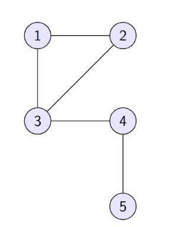
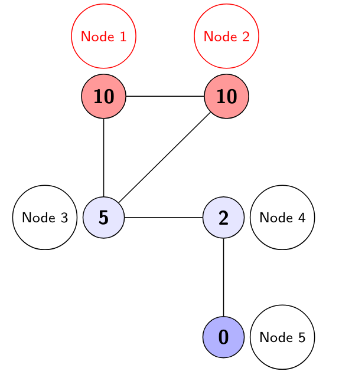

= BSB - Network Science
:toc:
:toc-title: Contents
:nofooter:
:stem: latexmath

== What is a biological network?

Networks/graphs are formal representations of interactions between entities

* in this case molecular entities
* Nodes stem:[V]: entities
* Edges stem:[E]: interactions

.Examples
* GRNs
** activation/inhibition
* Cell pathways
** chemical reactions in cells
* PPINs
** interactions between proteins

Using a *network science* approach allows us to:

* understand important nodes
** hubs
** find nodes that appear in multiple paths
* identify modules
** molecules related to different functions

== Graph representation

=== Adjacency Matrix (*A*)

Fundamental numerical representation of a graph stem:[G = (V, E)]

* square matrix of size stem:[N \cdot N]
** stem:[N] is the number of nodes
** if the graph is undirected stem:[A] is symmetric (stem:[A_{ij} = A_{ji}])
** if the graph is directed stem:[A] is asymmetric (stem:[A_{ij} \neq A_{ji}])
*** not necessarily if the 2 nodes influence each other but generally they're different

** if the graph is weighted stem:[A] contains the weight (stem:[w_{ij}]) of the interaction -> the strength of the connection

[stem]
++++
A_{ij} \{ w_{ij} \text{ if edge } (i, j) \in E\text{, else } 0
++++

Matrix multiplications can be used to count the number of paths between 2 nodes of a specific length

This is called the *matrix power*

* stem:[(A^k)_{ij}] -> number of paths of length stem:[k] between nodes stem:[(i, j)] 
** proteins with common interactors indicates that they are somewhat involved with each other
** summing the 1s of every cell of every matrix gives us the connectivity of the graph
*** summing the 1s of every row tells us how many nodes are connected to the node of the corresponding number
*** e.g. if row 3 has 3 1s then node 3 has 3 connections

.Example (stem:[k = 2]:)
if stem:[(A^2)_{ij} \gt 0]:

* stem:[(i, j)] are not necessarily directly connected
* they will have at least one common neighbor
** key principle for *functional genomics*
** highly connected proteins are often involved in a complex/pathway even if they don't bind

.Connectivity

the graph is connected if there is at least one pair stem:[(i,j)] for which the sum of all paths is greater than zero
[stem]
++++
\sum^{N - 1}_{k=1} (A^k)_{ij} \gt 0
++++

==== Example

Consider a graph stem:[G]:

Compute stem:[A^k] for paths with stem:[k=2] => stem:[A^2]

. Take nodes stem:[(1, 4)]
* no direct connection between targets => stem:[A_{14} = 0]
* path stem:[1 \rightarrow 3 \rightarrow 4] is the only path of length 2 between stem:[(1, 4)]

Therefore:

[stem]
++++

(A^2)_{14} = \sum^5_{k=1} A_{1k} A_{k4}\\

= (0 \cdot 0) + (1 \cdot 0) + (1 \cdot 1) + (0 \cdot 0) + (0 \cdot 1) = 1
++++

.Pseudocode
[source,python]
----
total = 0
for k in range(5):
    total += matrix[A_1k : A_k4]

# or:

total = sum(matrix[A_1k : A_k4] for k in range(5))
----

It's simply the sum of the products of the distances between nodes:

* in the first step we count the number of edges between stem:[A_1] and stem:[A_k] (at step 1 stem:[k=1])
** there are no edges between stem:[A_1] and stem:[A_1] so the distance is 0
* in the same step we count the number of edges between stem:[A_k] and stem:[A_4]
** still for stem:[k=1]
** there are no direct edges between stem:[A_1] and stem:[A_4] so it's also 0
* and so on and so forth

=== The degree matrix (*D*)

The degree of a node stem:[i] is the number of connections it has

[stem]
++++
k_i = \sum_j A_{ij}
++++

* putting the degrees in the diagonal of a square (stem:[N \cdot N]) matrix generates the degree matrix
** all non diagonal elements are 0
** the diagonal elements stem:[D_{ii}] are equal to the degree stem:[k_i] of node stem:[i]

stem:[D] by itself doesn't do much

* can assume that highest number = node with most connections = important node

It can be used to compute the Laplacian matrix

.Laplacian matrix
[stem]
++++
L = D - A
++++

* cell-wise subtraction of elements
* the rows and columns must sum to 0

It can be used to compute the *spectral properties*

* separate subnetworks in the graph
* equal to the number of stem:[\lambda = 0]

It can also be used to compute information diffusion

* how concentrations of some molecules diffuse throughout a network
* how certain proteins are involved in a disease

==== Diffusion operator example

Consider the same graph stem:[G] with annotated concentrations:

* using diffusion flow -> stem:[u = -(Lc)]
** stem:[u = Lc] computes the net outflow from each node

We can build a vector stem:[\mathbf{c}] where nodes stem:[(1, 2)] act as sources and node stem:[5] acts as a sink

* high concentration flows to low concentration

[stem]
++++
\mathbf{c} = [10, 10, 5, 2, 0]
++++

The product of stem:[\mathbf{L} \cdot \mathbf{c}] is a vector stem:[\mathbf{u}]

* dot product of the Laplacian matrix stem:[L] with the concentration vector stem:[c]

* positive values
** net outflow, will lose signal
** e.g. if stem:[u[1\] \gt 0] means they are giving more than they are receiving 
* negative values
** net inflow, will receive signal
** e.g. if stem:[u[1\] \lt 0] means they are giving more than they are receiving

== Sparsity and Computational Implications

Biological networks are very sparse

* most possible edges do not exist
** high number of possible links does not imply high number of known links

[stem]
++++
\text{Density } \rho = \frac{2M}{N(N-1)} \ll 1
++++

Where:

* stem:[N] is the size of the human proteome
** stem:[N \approx 20,000]
* stem:[M] is the number of known interactions between elements of the proteome
** a small fraction of all possible interactions

More efficient data structures are used instead 

* entire matrices have complexity stem:[O(N^{2})]

* adjacency lists

Graph algorithms (stem:[O(N+M)]) are also used instead of matrix algorithms (stem:[N^2])

=== Degree distribution

stem:[P(k)] is the probability that a randomly chosen node has exactly stem:[k] connections

* random networks follow a Poisson distribution
** bell shaped around the mean
** no/few hubs
* biological networks tend to follow the power law distribution stem:[P(k) \sim k^{- \gamma}]
** few nodes with lots of connections (hubs)
** exponential decay as degree increases
*** using log log plots the slope of the line is a parameter that represents the overall connections of the network

=== Hubs and network robustness

Biological networks are scale-free because of evolution

They are resistant to random failures

* losing a random node has a low probability of fragmenting the network
** there are few important nodes

However they are vulnerable to targeted attacks

* if the hubs are removed/inhibited the network will be fragmented
** hubs often represent essential genes (*Lethality centrality*)

=== Small-world property

Biological networks exhibit this property

. High average clustering
* neighbors of a node are highly connected to each other as well
* all nodes are close to each other
** indicates presence of localized functional modules

. Short average path length
* information transfer takes very few steps
* the average shortest path between each pair of nodes is short relative to the size of the network

Nodes have a clustering coefficient stem:[C_i] that measures the size of the node's cluster

[stem]
++++
C_i = \frac{2e_i}{k_i (k_i - 1)}
++++

where:

* stem:[e_i] is the number of existing edges between neighbors of stem:[i]
* stem:[k_i] is the maximum number of edges between neighbors of stem:[i]

==== Centrality example

Using graph stem:[G] from earlier

For node 1:

* it has degree stem:[k_1=2]
* it has neighbors stem:[\{ 2, 3 \}]
** they have 1 edge between them
** thus stem:[e_1 = 1]
* fill in the values: stem:[C_1 = \frac{2 \cdot 1}{2(2-1)} = 1]

While for node 3:

* it has degree stem:[k_3=3]
* it has neighbors stem:[\{ 1, 2, 4 \}]
** 1 edge between stem:[\{1, 2 \}]
** no edges between stem:[\{1, 4 \}]
** no edges between stem:[\{2, 4 \}]
** thus stem:[e_3 = 1]
* fill in the values: stem:[C_1 = \frac{2 \cdot 1}{3(3-1)} = \frac{2}{6} \approx 0.333]

=== Centrality

Importance is determined by centrality -> how central a node is within a network -> how well connected it is

Multiple ways to determine centrality depending on context and what we want to measure

==== Degree Centrality (stem:[C_D])

Measures number of direct connections and signals local essentiality and binding promiscuity

[stem]
++++
C_D(v) = k_v
++++
* computes the number of direct connections

High stem:[C_D] indicates high interactivity but ignores global structure

* a node might have lots of local connections but can do little to influence the network

==== Closeness Centrality (stem:[C_C])

Measures average distance to all other nodes, which indicates metabolic efficiency and speed of influence

[stem]
++++
C_C(v) = \frac{N-1}{\sum_u d(v, u)}
++++
* measures the efficiency with which a node can reach all other nodes in the network 
** stem:[d(v, u)] is the shortest path distance

High stem:[C_C] indicates high speed information transfer

==== Betweeness Centrality (stem:[C_B])

Counts the presence of target node between the shortest path between 2 other nodes

[stem]
++++
C_B(v) = \sum_{s \neq v \neq t} \frac{\sigma_{st} (v)}{\sigma_{st}}
++++

where:

* stem:[\sigma_{st}] is the number of shortest paths between stem:[s, t]
** there can be multiple paths of same length that qualify for shortest paths
* stem:[\sigma_{st}(v)] is the number of shortest paths between stem:[s, t] that also pass through stem:[v]

Low degree but high betweenness is a sign that the node may be a bottleneck/bridge

* kinase connecting 2 pathways

==== Spectral Centrality (eigenvector/pagerank)

Measures global influence/hierarchy

The general idea is that a node is important if it's connected to other important nodes

* quality > quantity

2 main methods:

.Eigenvector centrality (stem:[C_E])

The importance of a node is proportional to the importance of its neighbors
[stem]
++++
\mathbf{A}x = \lambda x
++++

where:

* stem:[\lambda] is the largest eigenvalue 
* stem:[x] is the eigenvector corresponding to stem:[\lambda]

.Generank/Pagerank

Based on Google's old search result ranking algorithm

More robust version of eigenvector centrality

* uses a teleportation factor (stem:[\alpha \approx 0.85])
* simulates a random walk with restart on the network

Used to rank genes/proteins based on the *quality* of their connections/influence

* not just the *quantity*

== Community/module detection

Identifying subgraphs

* areas with high internal connectivity (*dense connectivity*) and relatively low external connectivity (*sparse connectivity*)
** may correspond with some common function

.Strong communities
Every node in the community must have more internal than external connections to all nodes combined

.Weak communities
The total sum of internal connections is higher than the number of external connections

=== Modularity stem:[Q]

Brute force approaches to finding communities often do not work in practice

* bionets are huge

Modularity stem:[Q]
 measures how strongly a network is modularized

* how many modules/subgraphs there are
** higher -> more modular

stem:[Q] is given by:

[stem]
++++
Q = \frac{1}{2M}

\sum_{i, j}

\bigg(A_{ij} - \frac{k_i k_j}{2M} \bigg)

\delta (c_i, c_j)
++++

Where:

* stem:[A_{ij}] is the number of observed edges between stem:[i, j]
* stem:[\frac{k_i k_j}{2M}] is the number of expected edges between stem:[i, j] if edges are distributed randomly
* stem:[\delta (c_i, c_j)] is 1 if stem:[i, j] are in the same community, otherwise 0

=== Community detection algorithms

Formulate community detection as an optimization problem (maximizing Q as cheaply as possible)

* NP-hard
* heuristic algorithms are required

General approach (not heuristic)

. propose a partitioning of nodes into a community
. compute modularity (M)
. evaluate changes in the partitioning scheme that could increase M

For example:

. Louvain algorithm
* hierarchical and greedy

. Infomap
* based on information theory
* performs random walks
* modules are the regions where the walker spends the most time

== Generative Network Models

How are networks generated?

3 main ways:

. Random Model
* every edge forms with a random fixed probability
* results in homogenous degree distribution
** Poisson
* fails in biological applications

. Scale-free model
* Uses growth+preferential attachment
** new nodes will likely be connected to existing hubs
* results in power law distribution
** because of hubs
* usable in biological applications
** also because of hubs

. Evolutionary model
* imitates evolution
* nodes are duplicated and mutated
* results in scale free+small world distribution
** high clustering
* very faithful to biology

== Network Propagation

If a protein/gene is associated to a specific phenotype/disease:

* immediate neighbors are also likely to be involved
** can be seen by the Laplacian

*Network Propagation* simulates the spread of some score from an initial set of known nodes to the rest of the network

* input stem:[\mathbf{Y}]: binary/weighted vector of known initial genes
** differential analysis between gene expression in healthy cells and diseased cells
** this tells you the genes/proteins involved in the disease
* output stem:[\mathbf{F}]: score vector that measures the relevance of each gene based on its connectivity to the initial seed set 

=== Iterative propagation equation

The algorithm stabilizes after an iterative process that stops when the difference between the current output and previous output is below some threshold

[stem]
++++
F^{t+1} = \alpha \mathbf{A}' F^t + (1 - \alpha) Y
++++

Where:

* stem:[F^{t+1}] is the relevance score of all nodes
* stem:[F^{t}] is the relevance score of all nodes from the previous step
* stem:[\alpha] is the smoothing factor
** balances the influence of the first term against the second term
* stem:[\mathbf{A}'] is the normalized adjacency matrix

Propagation decays over time

* the nodes that had some value at the start will lose it
* their neighbors will gain some fraction of their loss
