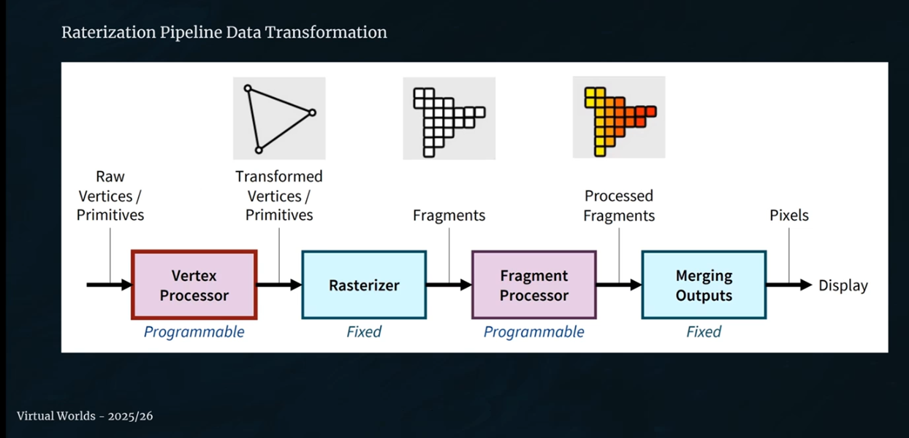

= Virtual Worlds - Fundamentals of Computer Graphics 
:toc:
:toc-title: Contents
:nofooter:
:stem: latexmath

== 3D geometry representations

=== Why does geometry matter in healthcare?

Need accurate geometric representation of real objects

* needs to be extremely close to the real thing

=== Graphics pipeline

Data passes through a chain of computational nodes that transforms it with every step until we get an output

Transform data into computer image

5 overall stages (actually many more irl)

. Application stage
. Geometry Processing
* assemble the data from application stage using mathematical/geometric concepts 
. Rasterization
* convert geometric primitives to draw the thing on the screen
* converts continuous to discrete
** i.e. makes a grid
* very fast GPU algorithm
* not physically accurate
. Fragment Shading
* identify pixel information
* identify how to process the fragment
** texture, color, vfx
. Output Merging
* put it all together

Multiple buffers used to generate final images

* depth buffer for 3D depth
** certain pixels need to go behind/in front of others
** stores the pixels nearest to the observer
** initialize with 1 and test if pixel is within a certain range
** if > then draw, else it's behind something else
** basically sorts primitives
* sometimes pixels are interleaved and we don't know which goes in front
* simple but expensive algorithm

== Mathematical Projection Systems

Use 100 year old concepts on modern graphics

=== Orthographic projection

No depth, everything is parallel to the observer

* the sun is so far from earth that we can consider the rays to be parallel when they hit the earth
** they aren't parallel because the sun is a sphere but it's so far that it doesnt really matter

=== Perspective projection

Warp the object to simulate depth

=== Projection methods in medical images

X-rays use orthographic mapping

* we don't want to distort perspective

3D visualization typically use perspective projection

* brain scans

== Rendering Approaches

=== Rasterization 

Fast but inaccurate

=== Ray Tracing

Simulates photons

Shoot simulated photon

* If it hits an object then it's lit

In practice we use reverse ray tracing

* cast ray from observer and see if it reaches light source
** if reaches light source then it's lit
** else unlit

Uses the first normal to determine whether the object is hit or not

Enables shadows, reflections and refractions for free basically

=== Modern rendering techniques

.Deferred rendering
Separates geometry and lighting passes

Do expensive operations only when necessary

.Global illumination
Simulates realistic light bouncing and ambient occlusion

* when a ray hits an object that object becomes a light itself

.Real time RT and Path Tracing
Very computational expensive

Very complex to use

Most realistic

== Vertex fundamentals 

How do we specify something real in (a) space?

* store its position
** `(x, y, z)` coordinates
** changes with coordinate system
*** there isn't a standard coordinate system
*** latiude/longitude/altitude are conventional -> not cartesian (banded artesian)
*** coordinate systems are created almost arbitrarily
*** terra centric, helio centric, flat projections (Mercator)

* represent color
** in some way, usually RGB(A)
*** HSL exists

* normal vector
** surface orientation for lighting calculations
** for a mirror: angle of incidence = angle of eccedence
*** comes in at 45 degrees and leaves at 45 degrees

* texture coordinates
** take 3D mesh and splat it on plane

=== Vertex attributes in WebGL

Web version of OpenGL

[source,javascript]
----
// WebGL vertex

gl.vertexAttribPointer(
    positionLocation,
    3,
    gl.FLOAT,
    false,
    0,
    0
)
----

== Geometric primitives

=== Points

A single point is represented by a single vertex

Most primitive of the primitives

=== Lines

2 points joined together (not really)

* technically segments

Needs 2 vertices

=== Triangles

First type of surface

need 3 points

the convexly enclosed space withn those points makes a surface

GPUs are good at triangles

Triangles can be used to generate all kinds of polygons

* planar
* can be assembled into any shape
** a square is just 2 triangles arranged in some way
** a hexagon is the same but 6

== Coordinate System Hierarchy

Using matrix multiplications we can move objects around in a space

There are different spaces

=== Object space

=== World space

=== View space

=== Clip space

=== Screen space

== Transformation matrix chain

Start in object space

Using the model matrix transformthe object space into world space

* gives world coordinates

stem:[V_{world} = M_{model} \cdot V_{object}]

Camera transform transforms world coords to camera coords

stem:[V_{camera} = M_{view} \cdot V_{world}]

Camera coords are then converted into clip space

stem:[V_{clip} = M_{proj} \cdot V_{camera}]

The output is converted into normalized coordinates so it can be drawn on screen

== Homogenous coordinates

Object matrix + matrix

* `x, y, z, w`

When you go from clip space to screen space you take the clip matrix and use `w` to represent everything between the eye of the observer and a given line

Divide `xyz` by `w` to get the screen coordinates

=== Point Clouds

=== Point Cloud Fundamentals

We have to assemble primitives into something we can look at

* points
* lines
* triangles

A point cloud is a collection of points

* unordered collection of 3D points
* a point is a reference to a vertex
* thus a point cloud is a list of vertices

Point clouds are generated by:

* LIDAR
* MRI/CT scans
* Photogrammetry

=== Point Cloud pros and cons

.Pros
High resolution acquisition

* they collect a lot of data
* more data than possible for other methods

.Cons
* Samples of a surface
** points exist independently
* No normal information
** need additional work to get that

== Surface representations

Using meshes 

* collection of connected triangles
* each triangle shares an edge with another triangle

Using enough triangles we can obtaina very good approximation of a surface

=== Mesh Classification

.Triangular meshes
As before

.Quad models
Easier to edit

.Polygonal meshes
use more abstract shapes for more specialized applications

These all use triangles at some point

=== Mesh Data Organization

. List of vertices
* coordinates for each point in mesh
. List of edges
* connections between vertices
* define mesh topology
. List of faces
* 
. Additional data

=== Mesh Processing Operations

Apply algorithms to triangles

.Simplification (LOD)

Use fewer triangles to represent objects that are too far from the observer for them to notice

* this saves resources

.Smoothing

Remove noise from data

Fix aliasing

.Subdivision surfaces

== Volumetric Representations

Fixed grid where you grab everything on every voxel of a volume

* voxel = 3D pixel

Basically the inside of a mesh

Much more expensive than a mesh

* grows cubically instead of quadratically

* 512^3 resolution eats 4GB of memory

=== Voxel grid math

Store position in space

Store what sensor is able to read

?????

=== Volume rendering techniques

.Direct Volume Rendering
Cast ray through volume where opacity < 1 and record everything

.Isosurface extraction

ma cristo bestia questo si ferma a metà

=== Skeletal Structures

hierarchycal geometric structure

* uses bone chains and joint relationships
* considers torso as the source
** can change depending on application

Tree/graph structure

==== Healthcare Applications

* Joint mechanics
* Prosthetics fitting
* Physical therapy

=== Skinning and Deformation

Rigs how a vertex moves according to a bone movement

* warp the surface when the angle between 2 bones changes

== Material Properties

3 main components

.Albedo
Base surface color

.Reflectivity
Amount of reflected/absorbed light

.Roughness
Micro structures that affect light scattering and glossiness

=== Texture mapping fundamentals

Any texture can be mapped on any surface

Projects 2D mimages onto 3D images using UV coordinates

* using *normal mapping*

== Lighting 

=== Phong model

Cheaper

Ambient light simulates ambient occlusion

Light can be diffused depending on the angle between the angle of the ray and the normal of the surface

Specular light is light that moves back into the observer's view from an object

=== Physically Based Rendering (PBR)

more realistic

based on physical properties

=== Shader programming

use GPU and specialized programs to write lighting

.Vertex shading
processes individual vertices

.dio stronzo ladro

bau